# HS2 臉部：參考點－座標系－Slider 架構圖

依 **HS2 原始碼**（`dll_decompiled/ShapeInfoBase.cs`、`AnimationKeyInfo.cs`、`ShapeHeadInfoFemale.cs`）整理。  
目的：從程式碼建立「Slider → 變形源 → 參考點」與座標系，以便推出可能的移動狀態，不需先靠大量採樣推測。

---

## 1. 整體資料流（高層）

```
┌─────────────────────────────────────────────────────────────────────────────────┐
│  SLIDER 層                                                                       │
│  shapeValueFace[category]   category = 0～58   (float，遊戲內多為 0～1)           │
│  儲存：ChaFileCustom.face → MessagePack；顯示：遊戲值 = round(float × 100)        │
└───────────────────────────────────┬─────────────────────────────────────────────┘
                                    │
                                    ▼
┌─────────────────────────────────────────────────────────────────────────────────┐
│  ShapeInfoBase.ChangeValue(category, value)                                       │
│  dictCategory[category] → List<CategoryInfo>  每項：.name = SrcName 字串         │
│  .id = SrcName 列舉值  .use[0/1/2][x/y/z] = 是否使用 pos / rot / scl 各分量       │
│  （dictCategory 來自 list/customshape → cf_customhead 文字表）                    │
└───────────────────────────────────┬─────────────────────────────────────────────┘
                                    │
                                    ▼
┌─────────────────────────────────────────────────────────────────────────────────┐
│  AnimationKeyInfo.GetInfo(SrcName, rate, ref value4, flag)                        │
│  rate = value（0～1 對應曲線頭尾）                                                │
│  index = (keyframeCount - 1) * rate → Lerp 相鄰兩 key 的 pos / rot / scl         │
│  曲線來自 ShapeAnime 二進位（頭部 bundle，如 cf_anmShapeFace）                    │
└───────────────────────────────────┬─────────────────────────────────────────────┘
                                    │
                                    ▼
┌─────────────────────────────────────────────────────────────────────────────────┐
│  dictSrc[SrcName_id] ← (vctPos, vctRot, vctScl)  虛擬變形源緩存                  │
└───────────────────────────────────┬─────────────────────────────────────────────┘
                                    │
                                    ▼
┌─────────────────────────────────────────────────────────────────────────────────┐
│  ShapeHeadInfoFemale.Update()                                                    │
│  固定寫法：dictDst[DstName_id].trfBone 的 localPosition / localRotation /        │
│            localScale 的指定分量 ← dictSrc[SrcName_id] 的對應分量                  │
│  參考點 = 頭部骨骼（DstName），座標系 = 各骨骼的 Local 空間                        │
└─────────────────────────────────────────────────────────────────────────────────┘
```

---

## 2. 骨骼的基準點與相對關係（依程式碼）

程式碼裡**所有臉部骨骼都有單一根節點與明確的相對關係**：

- **單一根節點（基準點）**  
`ShapeHeadInfoFemale.InitShapeInfo(..., Transform trfObj)` 會收到一個 **trfObj**（頭部或角色骨架的根 Transform）。  
`GetDstBoneInfo(trfBone, dictEnumDst)` 對每個 DstName 做 **TransformFindEx.FindLoop(trfBone, item.Key)**，也就是**在同一個 trfBone 底下**用名字遞迴搜尋骨骼。  
→ 所有 DstName 臉部骨骼都定義在**同一個根 trfObj 之下**，這個根就是臉部骨架的**基準點**（實際多為頭部 prefab 的根或身體的 objBodyBone）。
- **相對關係 = 父子階層**  
Unity 的 Transform 是樹狀結構：每個骨骼有 **parent**，自己的 **localPosition / localRotation / localScale** 是**相對於父節點**的。  
Update() 寫入的是各骨骼的 **local** 位移／旋轉／縮放，所以：
  - 每個骨骼的「位置」在程式裡 = **相對於父骨骼**的 local 變換；
  - 整棵樹從 trfObj 一路往下，就定義了所有骨骼之間的**相對關係**（誰是誰的父節點、相對位移／旋轉／縮放）。
- **小結**  
  - **基準點**：InitShapeInfo 傳入的 **trfObj**（臉部／頭部骨架的根）。  
  - **定義與相對關係**：骨骼以 **parent → child** 形成一棵樹；每個骨骼的位置 = 相對父節點的 **local** 值；所有 DstName 都在這棵樹裡，由同一根 trfObj 尋獲。

### 2.1 骨骼組織圖（依 DstName 列舉分區）

以下依 **ShapeHeadInfoFemale.DstName** 的宣告順序（dictDst 序號 0～51）與名稱前綴分區。實際父子階層以遊戲頭部 prefab 為準；此圖為邏輯分區，方便對照 Slider／參考點。

**若 Mermaid 圖字體過小，可改縮放預覽視窗（Ctrl + 滾輪），或直接看下方文字樹狀圖。**

```mermaid
%%{init: {'themeVariables': {'fontSize': '20px'}}}%%
flowchart TB
  Root["trfObj（根）"]
  Root --> G_Cheek["頬 Cheek (0-3)"]
  Root --> G_Chin["顎 Chin (4-6)"]
  Root --> G_Ear["耳 Ear (7-14)"]
  Root --> G_Eye["眼 Eye (15-30)"]
  Root --> G_Face["臉 Face (31-35)"]
  Root --> G_Megane["眼鏡 megane (36)"]
  Root --> G_Mouth["口 Mouth (37-42, 51)"]
  Root --> G_Nose["鼻 Nose (43-50)"]

  G_Cheek --> C0["0 CheekLow_L"]
  G_Cheek --> C1["1 CheekLow_R"]
  G_Cheek --> C2["2 CheekUp_L"]
  G_Cheek --> C3["3 CheekUp_R"]

  G_Chin --> Ch4["4 Chin_rs"]
  G_Chin --> Ch5["5 ChinLow"]
  G_Chin --> Ch6["6 ChinTip_s"]

  G_Ear --> E7["7-8 EarBase_s_L/R"]
  G_Ear --> E9["9-10 EarLow_L/R"]
  G_Ear --> E11["11-12 EarRing_L/R"]
  G_Ear --> E13["13-14 EarUp_L/R"]

  G_Eye --> Ey15["15-16 Eye_r_L/R"]
  G_Eye --> Ey17["17-18 Eye_s_L/R"]
  G_Eye --> Ey19["19-20 Eye_t_L/R"]
  G_Eye --> Ey21["21-28 Eye01～04_L/R"]
  G_Eye --> Ey29["29-30 EyePos_rz_L/R"]

  G_Face --> F31["31 FaceBase"]
  G_Face --> F32["32 FaceLow_s"]
  G_Face --> F33["33 FaceLowBase"]
  G_Face --> F34["34 FaceUp_ty"]
  G_Face --> F35["35 FaceUp_tz"]

  G_Mouth --> M37["37 Mouth_L"]
  G_Mouth --> M38["38 Mouth_R"]
  G_Mouth --> M39["39 MouthLow"]
  G_Mouth --> M40["40 Mouthup"]
  G_Mouth --> M41["41 MouthBase_s"]
  G_Mouth --> M42["42 MouthBase_tr"]
  G_Mouth --> M51["51 MouthCavity"]

  G_Nose --> N43["43 Nose_t"]
  G_Nose --> N44["44 Nose_tip"]
  G_Nose --> N45["45 NoseBase_s"]
  G_Nose --> N46["46 NoseBase_trs"]
  G_Nose --> N47["47 NoseBridge_s"]
  G_Nose --> N48["48 NoseBridge_t"]
  G_Nose --> N49["49-50 NoseWing_tx_L/R"]
```




**文字樹狀圖（字體與編輯器一致，方便閱讀）**：

```
trfObj（根）
├── 頬 Cㄝeek (0-3)
│   ├── 0 CheekLow_L    1 CheekLow_R    2 CheekUp_L    3 CheekUp_R
├── 顎 Chin (4-6)
│   ├── 4 Chin_rs    5 ChinLow    6 ChinTip_s
├── 耳 Ear (7-14)
│   ├── 7-8 EarBase_s_L/R    9-10 EarLow_L/R    11-12 EarRing_L/R    13-14 EarUp_L/R
├── 眼 Eye (15-30)
│   ├── 15-16 Eye_r_L/R    17-18 Eye_s_L/R    19-20 Eye_t_L/R
│   ├── 21-28 Eye01～04_L/R    29-30 EyePos_rz_L/R
├── 臉 Face (31-35)
│   ├── 31 FaceBase    32 FaceLow_s    33 FaceLowBase    34 FaceUp_ty    35 FaceUp_tz
├── 眼鏡 megane (36)
├── 口 Mouth (37-42, 51)
│   ├── 37 Mouth_L    38 Mouth_R    39 MouthLow    40 Mouthup
│   ├── 41 MouthBase_s    42 MouthBase_tr    51 MouthCavity
└── 鼻 Nose (43-50)
    ├── 43 Nose_t    44 Nose_tip    45 NoseBase_s    46 NoseBase_trs
    └── 47 NoseBridge_s    48 NoseBridge_t    49-50 NoseWing_tx_L/R
```

**序號對照（dictDst 索引 = DstName 列舉序）**：


| 區   | 序號        | 骨骼名                                                                    |
| --- | --------- | ---------------------------------------------------------------------- |
| 頬   | 0～3       | cf_J_CheekLow_L/R, cf_J_CheekUp_L/R                                    |
| 顎   | 4～6       | cf_J_Chin_rs, cf_J_ChinLow, cf_J_ChinTip_s                             |
| 耳   | 7～14      | cf_J_EarBase_s, EarLow, EarRing, EarUp（各 L/R）                          |
| 眼   | 15～30     | cf_J_Eye_r, Eye_s, Eye_t, Eye01～04, EyePos_rz（各 L/R）                   |
| 臉   | 31～35     | cf_J_FaceBase, FaceLow_s, FaceLowBase, FaceUp_ty, FaceUp_tz            |
| 眼鏡  | 36        | cf_J_megane                                                            |
| 口   | 37～42, 51 | cf_J_Mouth_L/R, MouthLow, Mouthup, MouthBase_s/tr, MouthCavity         |
| 鼻   | 43～50     | cf_J_Nose_t, Nose_tip, NoseBase_s/trs, NoseBridge_s/t, NoseWing_tx_L/R |


---

## 3. 座標系定義（依程式碼）


| 項目       | 說明                                                                                                                   |
| -------- | -------------------------------------------------------------------------------------------------------------------- |
| **空間**   | 每個 **DstName 骨骼**的 **Local 空間**（相對於**父節點**）。                                                                         |
| **變形量**  | `Vector3`：**pos**（位移）、**rot**（歐拉角，度）、**scl**（縮放）。                                                                    |
| **寫入方式** | `TransformPositionEx.SetLocalPositionX/Y/Z`、`TransformRotationEx.SetLocalRotation`、`TransformScaleEx.SetLocalScale`。 |
| **單位**   | 由 ShapeAnime 曲線資料決定（Unity 慣例：position 多為米或場景單位，rotation 度，scale 無單位）。                                                |


---

## 4. 參考點：頭部骨骼（DstName）

實際被改動的 **Transform** 為頭部骨架節點，列舉在 `ShapeHeadInfoFemale.DstName`（dictDst 的 key = 列舉序號）：


| 序號    | DstName（骨骼名）                                                 | 部位                           |
| ----- | ------------------------------------------------------------ | ---------------------------- |
| 0     | cf_J_FaceBase                                                | 臉基座                          |
| 1     | cf_J_FaceLow_s                                               | 臉下部                          |
| 2     | cf_J_FaceUp_ty                                               | 臉上部                          |
| 3     | cf_J_FaceUp_tz                                               | 臉上部                          |
| 4     | cf_J_FaceLowBase                                             | 臉下部基座                        |
| 5     | cf_J_ChinLow                                                 | 下顎                           |
| 6     | cf_J_Chin_rs                                                 | 下巴                           |
| 7     | cf_J_ChinTip_s                                               | 下巴尖                          |
| 8～14  | 頬・耳 (CheekLow, CheekUp, EarBase, EarLow, EarRing, EarUp)     | 頰、耳                          |
| 15,16 | cf_J_Eye_r_L, cf_J_Eye_r_R                                   | 眼（r）                         |
| 17,18 | cf_J_Eye_s_L, cf_J_Eye_s_R                                   | 眼（s）scale                    |
| 19,20 | cf_J_Eye_s_L, cf_J_Eye_s_R                                   | 眼（s）position ← **目横位置等會寫這裡** |
| 21～30 | cf_J_Eye_t, Eye01～04, EyePos_rz                              | 眼細部                          |
| 31,32 | cf_J_Nose_t, cf_J_Nose_tip                                   | 鼻                            |
| 33～39 | NoseBase, NoseBridge, NoseWing                               | 鼻樑、鼻翼                        |
| 40～44 | cf_J_Mouthup, Mouth_L/R, MouthLow, MouthBase_s, MouthBase_tr | 口                            |
| 45～50 | cf_J_NoseBridge_s, NoseBridge_t, NoseWing_tx, MouthCavity 等  | 鼻・口                          |
| 51    | cf_J_MouthBase_tr                                            | 口基座                          |


（完整 62 個見 `dll_decompiled/ShapeHeadInfoFemale.cs` 第 9～61 行。）

---

## 5. Slider（category）與語意名稱

shapeValueFace 的 **index = category**，與遊戲內滑桿語意對應（出處：`ChaFileDefine.cf_headshapename` / FaceShapeIdx，見 `MD FILE/HS2_Assembly-CSharp_臉部參數研究.md`）：


| category | 日文名     | FaceShapeIdx              | 本專案對應 slider（16 維）               |
| -------- | ------- | ------------------------- | -------------------------------- |
| 0        | 顔全体横幅   | FaceBaseW                 | head_width                       |
| 4        | 顔下部横幅   | FaceLowW                  | head_lower_width                 |
| 5        | 顎横幅     | ChinW                     | jaw_width                        |
| 11       | 顎先上下    | ChinTipY                  | chin_height                      |
| 19       | 目上下     | EyeY                      | eye_vertical                     |
| 20       | 目横位置    | EyeX                      | eye_span                         |
| 22,23    | 目の横幅・縦幅 | EyeW, EyeH                | eye_size                         |
| 24       | 目の角度Z軸  | EyeRotZ                   | eye_angle_z                      |
| 32       | 鼻全体上下   | NoseAllY                  | nose_height                      |
| 36       | 鼻筋高さ    | NoseBridgeH               | bridge_height                    |
| 39       | 小鼻横幅    | NoseWingW                 | nose_width                       |
| 47       | 口上下     | MouthY                    | mouth_height                     |
| 48       | 口横幅     | MouthW                    | mouth_width                      |
| 49       | 口縦幅     | MouthH                    | lip_thickness                    |
| 51,52    | 口形状上・下  | MouthUpForm, MouthLowForm | upper_lip_thick, lower_lip_thick |


**category → 實際變形**：由 **list/customshape（cf_customhead）** 決定每個 category 對應哪些 **SrcName**；程式碼內**沒有**寫死對應表。

---

## 6. SrcName（變形源）→ 參考點（DstName）對應

`Update()` 內為**固定寫法**：某個 `dictSrc[SrcName_id]` 的 pos/rot/scl 分量寫入某個 `dictDst[DstName_id].trfBone`。  
節錄與「眼・臉・口・鼻」相關的對應（其餘見 `ShapeHeadInfoFemale.cs` 第 193～272 行）：


| dictSrc 索引 | SrcName（列舉名）                                                                    | 寫入的參考點（dictDst）                                         | 寫入分量                                                        |
| ---------- | ------------------------------------------------------------------------------- | ------------------------------------------------------- | ----------------------------------------------------------- |
| 0,1        | cf_s_FaceBase_sx 等                                                              | cf_J_FaceBase (0)                                       | localPos.x / y / z                                          |
| 4,5        | cf_s_FaceLow_sx, cf_s_FaceUp_tz 等                                               | cf_J_FaceUp_ty (2), cf_J_FaceUp_tz (3)                  | localPos                                                    |
| 9～16       | Chin, ChinTip 相關                                                                | cf_J_FaceLowBase (4), ChinLow (5), Chin_rs (6)          | pos/rot/scl                                                 |
| 37～44      | **cf_s_Eye_sx_L/R, cf_s_Eye_sy_L/R, cf_s_Eye_tx_L/R, cf_s_Eye_ty, cf_s_Eye_tz** | **cf_J_Eye_s_L (19), cf_J_Eye_s_R (20)**                | **Eye_s 的 localPos.x ← tx, .y ← ty, .z ← tz；scale ← sx/sy** |
| 33～36      | cf_s_Eye_ry_L/R, cf_s_Eye_rz_L/R                                                | cf_J_Eye_r_L (15), cf_J_Eye_r_R (16)                    | localRot                                                    |
| 46～60      | Eye01～04, EyePos_rz                                                             | cf_J_Eye_t (21～24), Eye01～04 (25～28), EyePos_rz (29,30) | pos/rot                                                     |
| 64～82      | Nose 相關                                                                         | cf_J_Nose_t (32)～cf_J_NoseWing_tx (39)                  | pos/rot/scl                                                 |
| 83～99      | Mouth 相關                                                                        | cf_J_Mouthup (43)～cf_J_Mouth_L/R (49,50)                | pos/rot/scl                                                 |


因此：**目横位置（EyeX, category 20）** 在 cf_customhead 中若對應到 **cf_s_Eye_tx_L** 與 **cf_s_Eye_tx_R**，則經由 Update() 會改動 **cf_J_Eye_s_L** 與 **cf_J_Eye_s_R** 的 **localPosition.x**，即兩眼在局部 X 方向的位移，與「眼距」的幾何直接相關。

---

## 7. 本專案 16 維 Slider 在架構中的位置


| 本專案 slider (poc_name)                                                          | shapeValueFace index | 參考點（主要）                    | 變形源（推測，須以 cf_customhead 為準）  |
| ------------------------------------------------------------------------------ | -------------------- | -------------------------- | ---------------------------- |
| head_width                                                                     | 0                    | cf_J_FaceBase              | cf_s_FaceBase_sx             |
| head_lower_width                                                               | 4                    | cf_J_FaceLowBase 等         | cf_s_FaceLow_sx 等            |
| eye_span                                                                       | 20                   | cf_J_Eye_s_L, cf_J_Eye_s_R | cf_s_Eye_tx_L, cf_s_Eye_tx_R |
| eye_vertical                                                                   | 19                   | cf_J_Eye_s_L/R             | cf_s_Eye_ty                  |
| eye_size                                                                       | 22,23                | cf_J_Eye_s_L/R（scale）      | cf_s_Eye_sx, cf_s_Eye_sy     |
| eye_angle_z                                                                    | 24                   | cf_J_Eye_r_L/R 等           | cf_s_Eye_rz_L/R              |
| nose_height / bridge_height / nose_width                                       | 32,36,39             | Nose 系骨骼                   | Nose 系 SrcName               |
| mouth_height / mouth_width / lip_thickness / upper_lip_thick / lower_lip_thick | 47,48,49,51,52       | Mouth 系骨骼                  | Mouth 系 SrcName              |
| jaw_width / chin_height                                                        | 5,11                 | Chin 系骨骼                   | Chin 系 SrcName               |


---

## 8. 小結：如何從此架構推出「可能的移動狀態」

1. **參考點**：以 **ShapeHeadInfoFemale.DstName** 為準，即頭部骨骼清單。
2. **座標系**：各骨骼的 **Local 空間**，變形量為 pos / rot / scl（Vector3）。
3. **Slider**：shapeValueFace[category] → dictCategory[category] → **SrcName(s)**（須從 **cf_customhead** 取得）。
4. **移動狀態**：每個 SrcName 在 **ShapeAnime** 中有一條 keyframe 曲線；**rate = 0 / 1** 對應第一格／最後一格 key 的 (pos, rot, scl)，中間為 Lerp。解析曲線即可得到「該 Slider 在 0～1（或 -100～200 換算後）對應的幾何變形」。
5. **與 MediaPipe 對齊**：例如眼距 = 兩眼內角（landmark 133, 362）距離；HS2 端為 cf_J_Eye_s_L / cf_J_Eye_s_R 的 localPosition.x（由 cf_s_Eye_tx_L/R 驅動）。對齊兩邊的參考點與軸向後，即可推論「目横位置 -100／200」對應的大致眼距變化範圍（再以曲線數值為準）。

---

**出處**：`dll_decompiled/ShapeInfoBase.cs`、`AnimationKeyInfo.cs`、`ShapeHeadInfoFemale.cs`（反編譯自 `d:\HS4\Assembly-CSharp.dll`）；語意名見 `MD FILE/HS2_Assembly-CSharp_臉部參數研究.md`。