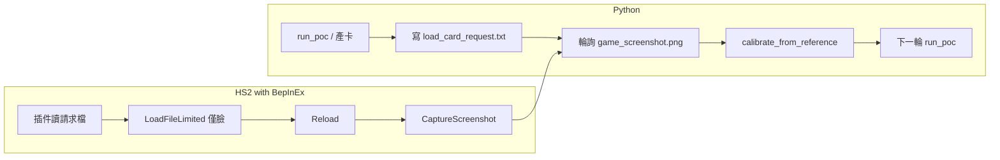

# BepInEx 自動載卡＋截圖整合計畫

## 目標

- **遊戲端（BepInEx 插件）**：偵測到「請求檔」時，自動載入指定角色卡（僅臉）、擷取目前畫面並存檔。
- **Python 端**：[auto_photo_to_card.py](d:\HS4\auto_photo_to_card.py) 產卡後寫入請求檔，輪詢等待截圖檔出現後再繼續校正，無需手動載卡與截圖。

唯一仍需手動：**先進入遊戲的角色編輯／讀取畫面**（插件只負責「載哪張卡」與「存截圖」，不負責開場景）。

---

## 1. 遊戲端：BepInEx 插件行為

### 1.1 觸發與路徑約定

- **請求檔**：例如 `output/load_card_request.txt`（或與 [auto_photo_to_card.py](d:\HS4\auto_photo_to_card.py) 共用的 `--out-dir` 下的固定檔名）。內容為**一行**：要載入的卡片**完整路徑**（或先實作「僅一行路徑」）。
- **截圖輸出**：同一目錄下固定檔名，例如 `game_screenshot.png`（與現有 [auto_photo_to_card.py](d:\HS4\auto_photo_to_card.py) 的 `SCREENSHOT_DEFAULT` 一致），或由請求檔第二行指定（可選，第二階段再擴充）。
- 插件在 **Update** 或定時檢查（例如每 0.5 秒）：若請求檔存在且可讀，讀取路徑後**刪除或清空該請求檔**（避免重複載入），再執行載卡＋截圖。

### 1.2 載卡邏輯（僅臉）

- 僅在「角色編輯」場景下動作（例如 `UnityEngine.SceneManagement.SceneManager.GetActiveScene().name` 為 HS2 角色編輯用場景，或 `Object.FindObjectOfType<CustomBase>()` / `CustomControl` 非 null 時才執行）。
- 取得當前 `ChaControl`：由 `CustomBase.customCtrl.chaCtrl` 取得（[CvsBase.cs](d:\HS4\dll_decompiled\CharaCustom\CvsBase.cs) / [CustomControl.cs](d:\HS4\dll_decompiled\CharaCustom\CustomControl.cs)）；需先 `FindObjectOfType<CustomBase>()` 或 `CustomControl` 取得 `customBase`，再取 `chaCtrl`。
- 載卡：呼叫 `chaCtrl.chaFile.LoadFileLimited(fullPath, chaCtrl.sex, face: true, body: false, hair: false, parameter: false, coordinate: false)`，對應 [CvsO_CharaLoad.cs](d:\HS4\dll_decompiled\CharaCustom\CvsO_CharaLoad.cs) 的 flags（第 34–41 行）。接著依原廠邏輯：`chaCtrl.ChangeNowCoordinate()`、`Singleton<Character>.Instance.customLoadGCClear = false`、`chaCtrl.Reload(reloadClothes: true, reloadFace: true, reloadHair: true, reloadBody: true)`、`customLoadGCClear = true`（與 [CvsO_CharaLoad.cs](d:\HS4\dll_decompiled\CharaCustom\CvsO_CharaLoad.cs) 第 41–44 行一致；Reload 參數對應 `!flag4, !flag, !flag3, !flag2`）。
- 若遊戲需在「讀取」子畫面才允許載入，則目前設計為：**使用者先手動打開讀取介面**，插件只做「從檔案路徑載入」；若實作時發現必須經由 UI 的 `CustomCharaWindow` 才能載入，再改為模擬點擊或呼叫內部「選定檔案並載入」的 API。

### 1.3 截圖

- 載卡並 Reload 後，延遲 1–2 個 frame 或短暫 `WaitForEndOfFrame`，再擷圖。
- 使用 `UnityEngine.ScreenCapture.CaptureScreenshot(path)` 寫入約定路徑（例如 `output/game_screenshot.png`），或沿用遊戲內 [Utils.Capture](d:\HS4\dll_decompiled\Illusion.Game\Utils.cs) / [CustomCapture](d:\HS4\dll_decompiled\CharaCustom\CustomCapture.cs) 的邏輯若更適合（例如只擷角色用相機）。
- 路徑需為絕對路徑；可從請求檔所在目錄推導（例如與請求檔同目錄的 `game_screenshot.png`）。

### 1.4 專案與程式位置

- 專案已存在 [BepInEx_HS2_PhotoToCard](d:\HS4\BepInEx_HS2_PhotoToCard)（BepInEx 5.x + HarmonyX），但僅有產生出的 AssemblyInfo / MyPluginInfo，**主插件類別可能尚未建立或不在版控**。
- 需在專案內新增一個繼承 `BepInEx.BaseUnityPlugin` 的類別，並：
  - 在 `Awake` 或 `Start` 註冊每 frame 或定時檢查。
  - 實作上述「讀請求檔 → 載卡（僅臉）→ 截圖 → 寫檔」流程。
- 需參照遊戲 Assembly-CSharp（或你專案中對應的 dll_decompiled 來源）編譯；通常需在 csproj 中參考遊戲的 `Assembly-CSharp.dll`、`UnityEngine.`* 等，路徑可指向遊戲 copy 的 `BepInEx/winhttp.dll` 同層的 Managed 目錄。

---

## 2. Python 端：auto_photo_to_card.py 改動

- 在產出 `ref_card_latest.png` 後（無論是第一次產卡或校正後再產卡）：
  - 將該卡的**絕對路徑**寫入 `output/load_card_request.txt`（或 `args.out_dir / "load_card_request.txt"`）。
  - 可選：同時寫入一行說明註解（例如 `# path`），插件只讀第一行或第一個非註解行當作路徑。
- 進入**輪詢**：每 1–2 秒檢查 `output/game_screenshot.png` 是否存在（或檢查檔案修改時間是否在寫入請求之後），最多等待例如 60–120 秒；若逾時則印出提示並結束或回傳失敗。
- 一旦偵測到 `game_screenshot.png` 存在：
  - 視為「遊戲已載卡並截圖」，直接繼續現有流程：用該截圖當 `screenshot_path` 做 **calibrate_from_reference**（若為第二輪）或僅產卡並提示（若為第一輪則目前邏輯是「等使用者手動放截圖」；可改為「第一輪也寫請求檔並輪詢」，則第一輪也會自動等截圖）。
- 若希望「第一輪只產卡、不自動等截圖」，可加參數例如 `--no-wait`，不加則預設為寫請求檔並輪詢等待。

---

## 3. 流程總覽

- 使用者需先**手動進入角色編輯並打開讀取介面**（或至少進入可顯示單一角色的畫面）。
- 之後每次執行 `auto_photo_to_card.py`：產卡 → 寫請求 → 等截圖 → 校正 → 再產卡，可重複執行直到滿意。

---

## 4. 實作順序建議

1. **BepInEx 插件**：新增主類別，實作「讀取請求檔、取得 ChaControl、LoadFileLimited（僅臉）+ Reload、截圖寫檔、刪請求檔」；編譯並放入遊戲 `BepInEx/plugins`，手動測試（手寫請求檔、確認載卡與截圖是否正確）。
2. **auto_photo_to_card.py**：產卡後寫入 `load_card_request.txt`，輪詢 `game_screenshot.png`，逾時與成功分支；可選 `--no-wait` 保留舊行為。
3. **整合測試**：依序執行「產卡 → 等截圖 → 校正 → 再產卡」，確認與現有 MediaPipe 校正流程一致。

---

## 5. 注意事項

- **場景**：插件僅在「角色編輯」場景且有 `CustomBase`/`ChaControl` 時動作，避免在標題畫面等誤觸。
- **路徑**：請求檔內路徑建議為**絕對路徑**，避免遊戲 working directory 與專案目錄不同導致找不到卡。
- **LoadFileLimited 回傳值**：[ChaFileControl.cs](d:\HS4\dll_decompiled\AIChara\ChaFileControl.cs) 反編譯結果中該方法結尾為 `return false`（約 511 行），若實際載入成功卻仍回傳 false，可能需依行為再調整（例如不依賴回傳值，只做 Reload 與截圖）。

