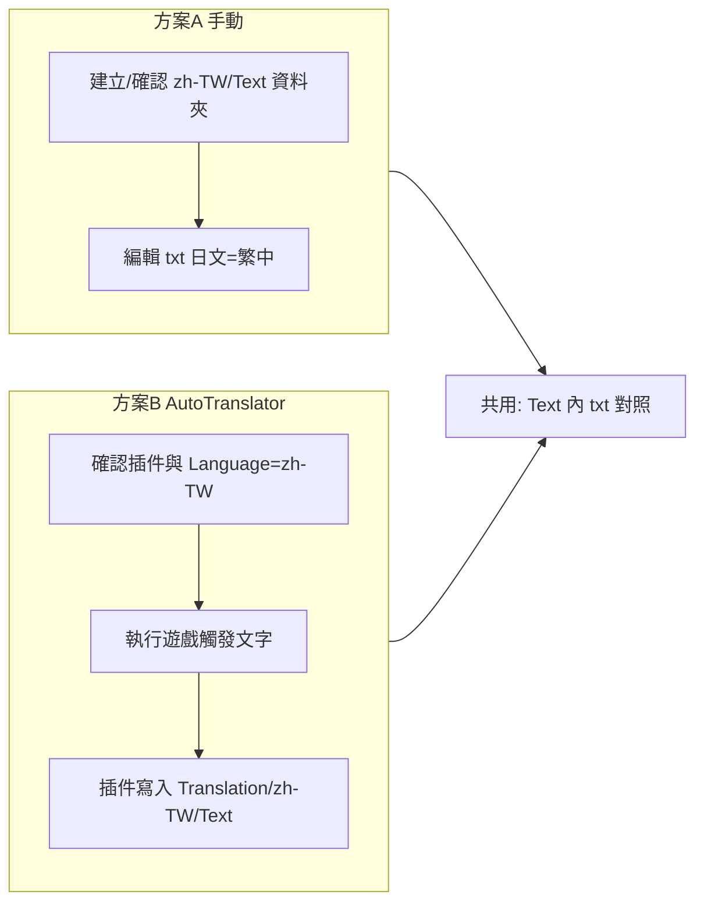

# HS2 日文→繁中翻譯對照補齊計畫

## 目標與約束

- **路徑**：`D:\hs2\BepInEx\Translation\zh-TW\Text\`
- **內容**：日文原文 → 繁中譯文的對照
- **約束**：不修改 Subtitles 插件設定

---

## AutoTranslator 翻譯檔格式（zh-TW/Text）

- 在此資料夾內放置 **.txt** 檔，編碼建議 **UTF-8**。
- 每行一筆對照，格式為：

```text
  日文原文=繁中譯文
  

```

- 檔名可依來源區分（例如依場景、AssetBundle 或插件名），例如：`Translation.txt`、`UI.txt`、`Subtitles.txt` 等；AutoTranslator 會讀取該資料夾下所有 txt。

---

## 實作方式（二擇一或並用）

### 方案 A：手動維護「日文 → 繁中」對照檔

1. **確認資料夾存在**
  - 若沒有則建立：`D:\hs2\BepInEx\Translation\zh-TW\Text\`
2. **新增或編輯 txt**
  - 在 `Text` 下建立/編輯 .txt（例如 `Manual.txt` 或依類別分檔）。
  - 每行：`日文原文=繁中譯文`，不帶引號。
  - 存檔時使用 **UTF-8**（建議帶 BOM 以相容部分環境）。
3. **日文原文來源**
  - 若你已有清單：直接貼上並補上繁中欄位即可。
  - 若沒有：可從遊戲/工具擷取（例如 Subtitles 插件匯出的文字、或從資源/腳本解出的字串），再整理成「一行一日文=一繁中」的格式。  
  - 本計畫不包含「從遊戲內自動撈出所有日文」的實作，若有需要可再另案做擷取腳本或流程。

**小結**：不碰 Subtitles 設定，只在新路徑下補齊/維護 txt 對照檔。

---

### 方案 B：讓 AutoTranslator 產生並寫入翻譯

1. **確認安裝**
  - `D:\hs2\BepInEx\plugins` 內已有 **XUnity.AutoTranslator**（或同名）插件。
2. **設定檔**
  - 編輯 `D:\hs2\BepInEx\config\AutoTranslatorConfig.ini`（或 BepInEx 產生的對應 ini）：
    - **Language**：目標語設為繁中（例如 `Language=zh-TW` 或依該插件說明之語系代碼）。
    - **FromLanguage**：來源語設為日文（例如 `FromLanguage=ja`），以利正確辨識原文並寫入對照。
    - 其餘（Endpoint、FallbackEndpoint、TextFrameworks 等）可依需求調整，不影響「寫入到 Translation」的基本行為。
3. **讓插件寫入翻譯**
  - 執行遊戲，在遊戲內觸發會顯示日文的地方（含你想翻譯的 UI/字幕等）。
  - AutoTranslator 會把「首次出現的日文」與其翻譯寫入 `Translation\zh-TW\Text\` 下的 .txt（通常會自動建立檔名）。
  - 若啟用線上翻譯（如 GoogleTranslateV2），會同時寫入「日文=機翻繁中」；之後可手動編輯同一批 txt 修正譯文。
4. **不變更 Subtitles**
  - 不修改 Subtitles 插件的設定檔或程式；僅透過 AutoTranslator 的 config 與上述路徑完成「產生/寫入翻譯」。

**小結**：透過 AutoTranslator 設定與遊戲執行，在 `zh-TW\Text\` 自動產生並寫入對照；再可視需要手動潤飾 txt。

---

## 建議流程（簡要）




- 若你**已有日文清單**或只想**精準控制譯文**：以方案 A 為主，必要時再搭配方案 B 補漏。
- 若你**希望先快速覆蓋大量文字**：以方案 B 為主，再回 `Text` 資料夾手動修正譯文。

---

## 注意事項

- **路徑**：目前工作區為 `d:\HS4`，實際操作會在 **D:\hs2**；若 D:\hs2 為網路磁碟或權限不同，需在該機上直接編輯或執行遊戲。
- **編碼**：手動編輯 txt 時請一律使用 **UTF-8**，避免繁中亂碼。
- **Subtitles**：全程不修改 Subtitles 插件設定，僅在 BepInEx Translation 與 AutoTranslator 端處理。

若你提供「日文原文列表」或希望從某個現有檔案/插件匯出日文，可再細化方案 A 的具體檔案命名與欄位對應。