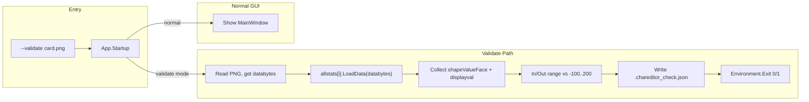

# HS2CharEdit 可被 Agent 驅動（驗證模式）實作計畫

## 目標

- 執行 `HS2CharEdit.exe --validate "path\to\card.png"` 時不顯示 GUI，僅用編輯器內建的讀卡邏輯驗證卡片並輸出報告。
- 輸出格式與現有 [run_poc.py](d:\HS4\run_poc.py) 產生的 [.chareditor_check.json](d:\HS4\9081374d2d746daf66024acde36ada77_card_20260224_0011.chareditor_check.json) 對齊，方便比對或取代 Python 端檢查。
- Exit code：0 = 全部在範圍內，1 = 有超出範圍或讀檔錯誤。

## 架構與流程

## 實作要點

### 1. 命令列處理與無 UI 分支

- **檔案**：[App.xaml.cs](d:\HS4\HS2CharEdit\HS2CharEdit\App.xaml.cs)、[App.xaml](d:\HS4\HS2CharEdit\HS2CharEdit\App.xaml)
- 在 `App.xaml` 中**移除 `StartupUri`**，改由程式碼控制是否顯示主視窗。
- 在 `App` 的 `Startup` 事件中：
  - 解析 `Environment.GetCommandLineArgs()`：若為 `--validate` + 卡片路徑（可選第三參數為輸出 JSON 路徑），則進入驗證流程。
  - 驗證流程：建立 `MainWindow` 並設為 `Application.Current.MainWindow`（供 `Charstat.LoadData` 內 `fillBox` 使用），呼叫新增的 `ValidateCard(path)`，寫出 JSON 後 `Environment.Exit(success ? 0 : 1)`，**不**呼叫 `Show()`。
  - 非驗證模式：`new MainWindow().Show()`，維持原有行為。

### 2. MainWindow 新增驗證方法

- **檔案**：[MainWindow.xaml.cs](d:\HS2CharEdit\HS2CharEdit\MainWindow.xaml.cs)
- 新增 **public** 方法：`ValidateCard(string cardPath, string? outputPath = null)`，回傳 `bool`（是否全部在範圍內）。
- 邏輯（與現有 `LoadCard` 前半一致，但不彈 MessageBox、不更新圖片）：
  1. `byte[] filebytes = File.ReadAllBytes(cardPath)`。
  2. 用現有 `Search(filebytes, "IEND")` 取得 IEND 位置，`databytes = filebytes.Skip(IENDpos + 8).ToArray()`。
  3. 若 `databytes.Length == 0`：寫入錯誤 JSON（含 `error` 欄位），回傳 false。
  4. 迴圈 `for (var i = 0; i < allstats.Length; i++) allstats[i].LoadData(databytes);`（與 [LoadCard 第 1376–1380 行](d:\HS4\HS2CharEdit\HS2CharEdit\MainWindow.xaml.cs) 相同）。
  5. 只取 **shapeValueFace**：篩選 `allstats` 中 `propName == "shapeValueFace"` 的項目，以 `controlname` 去掉前綴 `"txt_"` 作為 key（如 `txt_headWidth` → `headWidth`），`displayval` 轉成 int 作為 value，組成 `chareditor_read`。
  6. 範圍檢查：與 [read_face_params_from_card.py](d:\HS4\read_face_params_from_card.py) 一致，使用 **min = -100、max = 200**（`CHAEDITOR_FACE_MIN/MAX`），將各欄位分為 `chareditor_in_range` / `chareditor_out_of_range`。
  7. 組裝 JSON：`chareditor_limits`、`chareditor_read`、`chareditor_in_range`、`chareditor_out_of_range`、`chareditor_values_in_range`（bool）。可不含 `expected_written`（由 Python 端填寫）或留空。
  8. 寫檔：若 `outputPath == null`，預設為 `cardPath` 去掉副檔名再加 `.chareditor_check.json`；否則寫入 `outputPath`。
  9. 回傳 `chareditor_values_in_range`（即 `out_of_range` 為空）。

### 3. 依賴與注意點

- `LoadData` 會呼叫 `fillBox(controlname, displayval, ...)`，需有 `Application.Current.MainWindow` 存在；因此在驗證路徑中先 `new MainWindow()` 並設為 `Current.MainWindow`，再呼叫 `ValidateCard`，不呼叫 `Show()` 即可。
- `Search` 為 instance 方法，維持在 `MainWindow` 內使用即可，無需抽離。
- JSON 序列化：可加入 `System.Text.Json` 或沿用現有慣例；若專案無 JSON 庫，可加入 NuGet `System.Text.Json` 並用 `JsonSerializer.Serialize` 寫出與現有範例相同結構。

### 4. 與 Python 端整合（建議，不在此次 C# 變更範圍）

- [run_poc.py](d:\HS4\run_poc.py) 在寫入卡片後，可改為呼叫 `HS2CharEdit.exe --validate 產出卡路徑`，依 exit code 決定是否視為驗證通過；若需與現有 `.chareditor_check.json` 並存，可讓 C# 寫入同一檔名，或由 Python 傳入第三參數指定輸出路徑。

## 輸出格式對齊（摘要）

與現有 `.chareditor_check.json` 一致：

- `chareditor_limits`: `{ "min": -100, "max": 200 }`
- `chareditor_read`: `{ "headWidth": 64, "eyeSpacing": 25, ... }`（僅 shapeValueFace 欄位，key 為去掉 `txt`_ 之名）
- `chareditor_in_range` / `chareditor_out_of_range`: 同上結構，依數值是否在 [min, max] 分類
- `chareditor_values_in_range`: boolean

## 檔案變更清單

| 檔案                                                                                              | 變更                                                                                                               |
| ----------------------------------------------------------------------------------------------- | ---------------------------------------------------------------------------------------------------------------- |
| [HS2CharEdit/HS2CharEdit/App.xaml](d:\HS4\HS2CharEdit\HS2CharEdit\App.xaml)                     | 移除 StartupUri；必要時保留 Startup 事件宣告                                                                                 |
| [HS2CharEdit/HS2CharEdit/App.xaml.cs](d:\HS4\HS2CharEdit\HS2CharEdit\App.xaml.cs)               | 加入 Startup 處理：解析 --validate、建立 MainWindow、呼叫 ValidateCard、寫檔並 Environment.Exit                                   |
| [HS2CharEdit/HS2CharEdit/MainWindow.xaml.cs](d:\HS4\HS2CharEdit\HS2CharEdit\MainWindow.xaml.cs) | 新增 public bool ValidateCard(string cardPath, string? outputPath = null)，實作上述讀檔 / LoadData / 篩選臉部 / 範圍檢查 / 寫 JSON |
| [HS2CharEdit/HS2CharEdit/HS2CharEdit.csproj](d:\HS4\HS2CharEdit\HS2CharEdit\HS2CharEdit.csproj) | 若尚未引用，加入 System.Text.Json 的 PackageReference                                                                     |

## 測試建議

- 用一張「raw 布局」的卡（非 MessagePack）執行 `HS2CharEdit.exe --validate "card.png"`，確認產生的 `.chareditor_check.json` 與 Python `read_face_params_from_card` + `check_chareditor_limits` 結果一致。
- 用一張 MessagePack 卡驗證，確認會出現 out_of_range 且 `chareditor_values_in_range == false`、exit code 1。
- 無 `--validate` 時確認 GUI 正常啟動、開檔/存檔行為不變。

