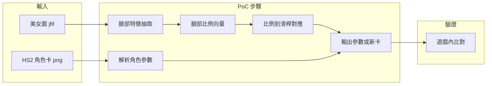

# HS4 臉部復刻 PoC 開發計畫

## 一、現有資源分析

| 檔案                                       | 大小          | 用途假設                                              |
| ---------------------------------------- | ----------- | ------------------------------------------------- |
| `1 (1).jfif`, `1 (2).jfif`, `1 (3).jfif` | ~197–215 KB | AI 美女圖，作為「目標臉」輸入                                  |
| `AI_191856.png`                          | ~166 KB     | HS2 角色卡（待驗證：PNG 內含 `chara` / `ccv3` 等 tEXt chunk） |

目前 **d:\HS4 內無任何程式碼**，從零開始。HS2 角色卡為 PNG，角色資料嵌在 PNG 的 tEXt chunk（關鍵字 `chara` 或 `ccv3`），內容為 base64 解碼後的二進位（多為遊戲自訂或 MessagePack），需依 Illusion 格式解析。

### HS2 安裝環境（D:\HS2）

| 項目 | 內容 |
|------|------|
| 版本 | Better Repack R16 (CH)，含 HoneySelect2.exe / StudioNEOV2.exe |
| 角色卡路徑 | `D:\HS2\UserData\chara\female\`（多張 AI_*.png，與 d:\HS4\AI_191856.png 同檔名存在於此，165828 bytes 一致，可視為同一張卡） |
| BepInEx | 已安裝，插件位於 `BepInEx\plugins` |
| 臉型相關插件 | **HS2ABMX.dll** (BonemodX v5.2.2)、**HS2_SliderUnlocker.dll** (v20.0)、**HS2_ExtensibleSaveFormat.dll**、**HS2_MaterialEditor.dll**、**HS2_OverlayMods.dll**、BonesFramework、Deformers 等 |
| ABMX 設定 | `BepInEx\config\KKABMX.Core.cfg`：maker 黃色滑桿開啟、進階骨骼編輯可用（快捷鍵可設）、Reset 還原卡片值 |
| SliderUnlocker 設定 | `BepInEx\config\com.bepis.bepinex.sliderunlocker.cfg`：滑桿範圍 -100～200（原 0–100） |
| 其他工具 | `[UTILITY] HS2CharEdit`、KKManager、Card Image Replacer、RuntimeUnityEditor（遊戲內檢視） |
| mods | `mods\` 僅 2 個 zipmod；大量內容以 BepInEx 插件形式安裝 |

PoC 驗證時可直接用 **D:\HS2** 啟動遊戲，角色卡可讀自 `d:\HS4\` 或複製到 `D:\HS2\UserData\chara\female\` 載入；產出的新卡若寫回 PNG，可放回上述路徑測試。

---

## 二、整體流程與 PoC 範圍

**PoC 目標：** 用 **1 張圖 + 1 張卡**，跑通「圖 → 臉部數字 → 對應到 HS2 參數」並產出可載入的結果（參數檔或改寫後的角色卡），用來在遊戲內肉眼/主觀驗證像不像。

**刻意縮小範圍：**

- 只處理「臉部」相關參數（例如眼睛、臉型、鼻子、嘴的少數滑桿或 ABMX 骨骼），不一次對齊全部 200+ 滑桿。
- 對應關係先做 **3–5 個關鍵比例 → 3–5 個參數**，用查表或線性關係即可。
- 不建完整 2D→3D 模型，不保證完全復刻。

---

## 三、階段規劃

### 階段 0：資源驗證（必做）

- **0.1 驗證 PNG 是否為 HS2 卡**  
  - 讀取 `AI_191856.png` 的 PNG chunk（例如用 Python `png` 或 `PIL` 讀取 tEXt chunk）。  
  - 若存在 `chara` 或 `ccv3` 且可 base64 解碼得到二進位，則視為 HS2 卡；否則標註「非標準卡」或需另備卡檔。
- **0.2 驗證美女圖可讀**  
  - 用 Pillow/OpenCV 開啟 3 張 jfif，確認能解碼、能取得尺寸與後續可做臉部偵測。

產出：簡短報告（哪個檔案是卡、圖片是否正常），決定後續用哪一張圖 + 哪一張卡做 PoC。

---

### 階段 1：單向抽取（圖 → 數字、卡 → 數字）

- **1.1 臉部特徵抽取（圖 → 比例）**  
  - 技術：Python + **MediaPipe Face Mesh** 或 **dlib 68 點**（二選一，建議先用 MediaPipe，依賴少）。  
  - 輸入：1 張 jfif（例如 `1 (1).jfif`）。  
  - 輸出：一組「臉部比例」數值，例如：眼距比、眼高比、臉寬/臉長、鼻寬比、嘴寬比等（定義 5–8 個即可）。  
  - 產出：單一腳本 `extract_face_ratios.py`（或同功能 notebook），讀取指定路徑、印出或存成 JSON。
- **1.2 HS2 角色參數讀取（卡 → 參數）**  
  - 從 PNG 抽出 `chara`/`ccv3` → base64 decode → 解析二進位（需查 IllusionModdingAPI 或 HS2 存檔結構；若格式複雜可先用現成工具如 [HS2CharEdit](https://github.com/CttCJim/HS2CharEdit) 匯出可讀格式，再寫小腳本讀）。  
  - 目標：取得「臉部相關」欄位（例如 custom face 滑桿、或 ABMX 存的骨骼 scale/position），存成鍵值對或 JSON。  
  - 產出：腳本 `read_hs2_card.py`，輸入 `AI_191856.png`，輸出例如 `hs2_face_params.json`。

依賴：若 ChaFile 為專有二進位，需參考 [IllusionModdingAPI](https://github.com/IllusionMods/IllusionModdingAPI) 或社群文件定義欄位與型別。

---

### 階段 2：最小對應與一鍵 PoC

- **2.1 定義對應表（比例 → 滑桿）**  
  - 選定 3–5 個「臉部比例」對應到 3–5 個 HS2 參數（或 ABMX 骨骼名 + 一軸 scale/position）。  
  - 對應方式：手動訂表（例如區間線性映射），或先用 1 張「已手動調好的卡」反推一組比例↔參數範例再寫死映射。  
  - 產出：一份對應表（JSON 或程式內 dict）及簡短說明（哪個比例對應哪個參數、範圍）。
- **2.2 一鍵 PoC 流程**  
  - 輸入：1 張 jfif、1 張 HS2 卡 PNG。  
  - 步驟：執行 1.1 → 得到比例；執行 1.2 → 得到目前卡參數；用 2.1 對應表將「目標比例」轉成「目標參數」；依遊戲/插件可接受方式產出「新參數」或「新卡」。  
  - 產出：主腳本 `run_poc.py`（或單一 notebook）呼叫上述步驟，輸出為「可載入的參數檔」或「覆寫/另存後的 PNG 卡」。

若寫回 PNG 卡需實作：解碼 → 改 ChaFile 對應欄位 → 再 base64 → 寫回 tEXt chunk。難度較高時，PoC 可改為只輸出 **參數 JSON**，由使用者手動用遊戲內插件或外部編輯器套用。

---

### 階段 3：小規模驗證與文件

- **3.1 跑 3 張圖**  
  - 對 3 張 jfif 各跑一次 PoC，產出 3 組參數（或 3 張改寫卡）。  
  - 在 HS2 內載入並主觀比對「像不像」、是否崩臉，記錄結果（例如簡單表格：檔案名、是否可用、備註）。
- **3.2 簡短文件**  
  - README：如何安裝依賴（Python 版本、pip 套件）、如何執行階段 0/1/2/3、輸入輸出路徑說明、對應表意義。  
  - 註明 PoC 限制：僅驗證概念、對應表需日後擴充與調參。

---

## 四、技術選型建議

| 項目      | 建議                           | 備註                                   |
| ------- | ---------------------------- | ------------------------------------ |
| 語言      | Python 3.10+                 | 方便做影像與簡單二進位解析                        |
| 臉部特徵    | MediaPipe Face Mesh          | 依賴少、易用；可後續換 dlib 提高精度                |
| 圖片 I/O  | Pillow (PIL)                 | 讀 jfif、PNG；PNG chunk 可用 `png` 或自讀二進位 |
| HS2 卡解析 | 先查 IllusionModdingAPI / 現成工具 | 若無現成庫則需逆向 ChaFile 欄位                 |
| 輸出      | 優先「參數 JSON」                  | 寫回 PNG 卡可列為後續改進                      |

---

## 五、產出清單（PoC 完成時）

- 資源驗證結果（PNG 是否為卡、圖是否可用）。
- `extract_face_ratios.py`：圖 → 臉部比例 JSON。
- `read_hs2_card.py`：HS2 卡 PNG → 臉部參數 JSON。
- 對應表（比例 ↔ HS2 參數）及說明。
- `run_poc.py`：一鍵從 1 圖 + 1 卡產出參數（或新卡）。
- 3 張圖的驗證紀錄與簡短 README。

---

## 六、風險與假設

- **PNG 非 HS2 卡或格式不同**：階段 0 若失敗，需你提供一張確定可被 HS2 讀取的範例卡，或改為「只產參數 JSON」由手動/插件套用。
- **ChaFile 二進位格式不明**：需依賴 IllusionModdingAPI、HS2CharEdit 或社群文件；若無法解析，PoC 改為「只做圖→比例」與手動對照表，參數由人工輸入遊戲。
- **2D→3D 差異**：PoC 僅驗證「有對應、可驅動」，不保證還原度；像度需在遊戲內主觀評估並迭代對應表。

若你同意此方向，下一步可從階段 0 的「PNG chunk 檢查」與「jfif 可讀性」開始實作（需切換到 Agent 模式執行）。