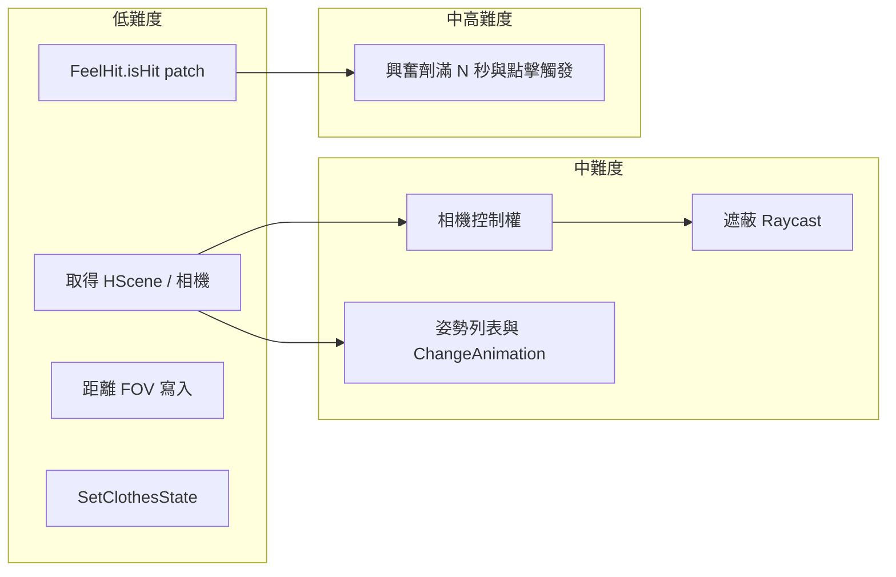

# 環視與興奮劑插件 — 實現難點檢查

依據 [dll_decompiled](d:\HS4\dll_decompiled) 與既有規格 [遊戲焦點選擇與環視前置](遊戲焦點選擇與環視前置_faf812b4.plan.md)，以下為實作時較有困難或需特別注意的部分，以及建議作法。

---

## 1. 取得 H 場景與相機（難度：低）

- **取得 HScene**：`Singleton<HSceneManager>.Instance.Hscene`（[HSceneManager.cs](d:\HS4\dll_decompiled\Manager\HSceneManager.cs) 約 2989 行 `public HScene Hscene`）。需先確認 `Singleton<HSceneManager>.IsInstance()` 且不在 H 場景時 `Hscene` 可能為 null。
- **相機與焦點**：`hScene.ctrlFlag.cameraCtrl` 為 `CameraControl_Ver2`；`transBase`、`targetObj`、`TargetPos`、`CameraDir`、`CameraFov`、`autoCamera(float)` 皆可從插件存取（[BaseCameraControl_Ver2](d:\HS4\dll_decompiled\BaseCameraControl_Ver2.cs) 159–216 行）。
- **結論**：無需 Harmony patch，直接引用遊戲 Assembly-CSharp，在 BepInEx 的 Update/LateUpdate 中即可取得並驅動。

---

## 2. 環視時「搶奪」相機控制權（難度：中）

- **狀況**：遊戲在 `LateUpdate` 中依 `NoCtrlCondition`、滑鼠、鍵盤設定 `isControlNow`，並用 `CamDat` 更新相機。若環視時不處理，玩家拖曳或按 Q/W/E 會覆寫我們設的 Rot/ TargetPos/Dir。
- **可行作法**（二擇一或並用）：
  - **A. 每幀覆寫**：插件在 **LateUpdate** 且設 **Script Execution Order** 大於預設，使我們在相機的 LateUpdate 之後執行，每幀強制寫入 `TargetPos`、`CameraDir`、`Rot`（或透過 `autoCamera` 只改 Rot.y）。優點實作簡單，缺點若順序不穩可能偶發被遊戲先寫再被我們蓋掉。
  - **B. 關閉遊戲輸入對相機的影響**：環視啟動時暫存並替換 `ctrlFlag.cameraCtrl.NoCtrlCondition`，讓其在環視中回傳 `false`（使 `isControlNow` 不因該委派為 true），必要時再 patch `BaseCameraControl_Ver2.LateUpdate` 開頭：若環視進行中則跳過輸入處理、只保留最後的 `CameraUpdate()`。停止環視時還原委派。
- **建議**：先做 A（Execution Order + 每幀寫入），若仍被輸入干擾再補 B。

---

## 3. 姿勢列表與 ChangeAnimation 呼叫（難度：低～中）

- **姿勢列表**：`HSceneManager.HResourceTables.lstAnimInfo`（靜態取得，[HSceneManager.cs](d:\HS4\dll_decompiled\Manager\HSceneManager.cs) 3128–3137 行）。為 `List<HScene.AnimationListInfo>[]`，長度 7（依動作類別）。需注意僅在 H 場景載入完成後才有內容。
- **換姿勢**：`HScene.ChangeAnimation(AnimationListInfo, bool isForceResetCamera, bool isForceLoopAction, bool useFade)` 為 **IEnumerator**（[HScene.cs](d:\HS4\dll_decompiled\HScene.cs) 2052 行起），必須用 **Coroutine** 執行：`hScene.StartCoroutine(hScene.ChangeAnimation(info, ...))`。
- **難點**：`ChangeAnimation` 內會呼叫 `GlobalMethod.setCameraMoveFlag(ctrlFlag.cameraCtrl, false)`，會把 `NoCtrlCondition` 設成 `() => true`，導致該幀起 `isControlNow` 可能被設為 true，相機可能短暫交給玩家邏輯。若與「環視搶奪相機」並用，需在換姿勢完成後再次鎖定環視控制（例如重新套用我們的 NoCtrlCondition 或每幀覆寫）。
- **結論**：取得姿勢列表與呼叫換姿勢皆可直接用公開 API；與相機控制權的配合需在「換姿勢完成後」明確恢復環視狀態。

---

## 4. 興奮劑「有動就命中」— patch FeelHit.isHit（難度：低）

- **呼叫點**：`ctrlFlag.isGaugeHit = feelHit.isHit(_infoAnimList.nFeelHit, _loop, ctrlFlag.speed, resist)` 等（例如 [MultiPlay_F2M1.cs](d:\HS4\dll_decompiled\MultiPlay_F2M1.cs) 1192、1252、1615、1665 行）。`_power` 即 `ctrlFlag.speed`。
- **邏輯**：`FeelHit.isHit` 內部用 `GlobalMethod.RangeOn(_power, hitArea.x, hitArea.y)` 判斷（[FeelHit.cs](d:\HS4\dll_decompiled\FeelHit.cs) 128–131 行）。
- **作法**：Harmony **Prefix**：若 `_power > 0` 則 `__result = true; return false;`（不執行原方法）；否則 `return true`。一處 patch 即可涵蓋所有呼叫。
- **結論**：單一 patch、實作簡單。

---

## 5. 興奮劑「滿 N 秒才觸發／點滑鼠立刻觸發」（難度：中高）

- **狀況**：遊戲在多處（如 MultiPlay_F2M1、MultiPlay_F1M2、Les、Masturbation 等）檢查 `ctrlFlag.selectAnimationListInfo == null && ctrlFlag.feel_f >= 1f` 後執行 `setPlay("Orgasm"...)`、`ctrlFlag.speed = 0f`。要改成「滿了後再等 N 秒」或「點滑鼠立刻觸發」。
- **難點**：
  - 觸發點分散在多個類別、多個方法內，需 patch 多處，或找共用的「門檻通過」點。
  - 需共用狀態：何時達到滿（feel_f >= 1）、計時 N 秒、以及「滑鼠點擊」的判定（例如 `Input.GetMouseButtonDown(0)`）。
- **可行作法**：
  - **方案 A**：在插件內維護「已滿且尚未觸發」狀態與時間戳；對所有「if (feel_f >= 1f) { setPlay(Orgasm); ... }」的區塊做 Harmony **Prefix**，改為「若 feel_f >= 1 且 插件.ShouldTriggerOrgasmNow() 為 true 才放行，否則 return false（不執行原邏輯）」。`ShouldTriggerOrgasmNow()` 內：滿了後經過 N 秒或本幀有滑鼠點擊則 true，並 consume 一次觸發。
  - **方案 B**：集中 patch 一處「寫入 feel_f」的邏輯，在即將寫入 1 時改寫成 0.99，並在插件內計時／點擊後再放行一次寫入 1；實作上要避免與其他邏輯衝突，難度較高。
- **建議**：採用方案 A，雖需列舉並 patch 多個觸發點，但行為清晰、不影響原數值邏輯。可先做「點滑鼠立刻觸發」，再加「滿 N 秒」計時。

---

## 6. 距離與 FOV 的寫入（難度：低）

- **CamDat** 在 BaseCameraControl_Ver2 為 `protected`，但對外已有公開屬性：`TargetPos`（= CamDat.Pos）、`CameraDir`（= CamDat.Dir）、`CameraFov`（= CamDat.Fov）。距離為 `CameraDir.z`（負值）。可直接從插件讀寫，無需反射或 patch。

---

## 7. 遮蔽（相機與焦點間障礙物）（難度：中）

- **現況**：H 場景使用 CameraControl_Ver2，**沒有**「相機到焦點」的 Raycast 遮蔽（規格 §4）。[CollisionCamera.cs](d:\HS4\dll_decompiled\CollisionCamera.cs) 僅用於舊版相機，且依 tag "CollDels" 隱藏 Renderer。
- **作法**：在插件內每 2 秒（或可調）從 `cameraCtrl.transform.position` 到當前焦點（例如 `transBase.TransformPoint(cameraCtrl.TargetPos)`）做 `Physics.RaycastAll`，對 hit 的物件依需求隱藏 Renderer 或調整距離；停止環視時還原。
- **注意**：需確認場景障礙物的 layer 是否在 Raycast 的 layerMask 內、以及還原時機（避免永久隱藏）。若遊戲內建無 "CollDels"，需自訂規則（例如 layer 或特定元件）。

---

## 8. 衣物階段（SetClothesState）（難度：低）

- **API**：[ChaControl.SetClothesState(int clothesKind, byte state, bool next)](d:\HS4\dll_decompiled\AIChara\ChaControl.cs) 2533 行、`SetClothesStateAll(byte state)` 2644 行。槽位 0～7 對應 ChaFileDefine.ClothesKind（top, bot, inner_t, inner_b, gloves, panst, socks, shoes）。
- **結論**：對 `chaFemales`、`chaMales` 等遍歷並呼叫即可，無需 patch。

---

## 9. 依賴與實作順序建議

- **建議實作順序**：先做「僅環視」最小可測：熱鍵、取得 HScene/相機、每幀驅動 `autoCamera` 或直接寫 Rot.y，不換焦點/姿勢/衣物，確認旋轉與控制權無誤。再依序加入：距離重算、焦點/角度亂數、姿勢切換與衣物階段、遮蔽。興奮劑兩項可獨立：先 patch `FeelHit.isHit`，再處理「滿 N 秒／點擊觸發」的多點 patch。

---

## 10. 總結表

| 項目 | 難度 | 要點 |
|------|------|------|
| 取得 HScene / 相機 / 焦點 | 低 | Singleton&lt;HSceneManager&gt;.Instance.Hscene，公開 API |
| 環視時相機控制權 | 中 | LateUpdate 順序每幀覆寫，或替換 NoCtrlCondition / patch LateUpdate |
| 姿勢列表與 ChangeAnimation | 低～中 | HResourceTables.lstAnimInfo，StartCoroutine(ChangeAnimation)；換姿勢後需恢復環視控制 |
| 興奮劑「有動即命中」 | 低 | Harmony Prefix patch FeelHit.isHit，speed>0 即 __result=true |
| 興奮劑「滿 N 秒／點擊觸發」 | 中高 | 多處 feel_f>=1 觸發點需 patch，共用計時與點擊狀態 |
| 距離 / FOV 寫入 | 低 | TargetPos、CameraDir、CameraFov 已公開 |
| 遮蔽 | 中 | 自建 Raycast，每 2 秒；還原與 layer/tag 需自訂 |
| 衣物階段 | 低 | SetClothesState / SetClothesStateAll 遍歷角色 |

若你希望，我可以把某一項拆成更細的實作步驟（含建議的 Harmony 目標方法名與簽名）。
