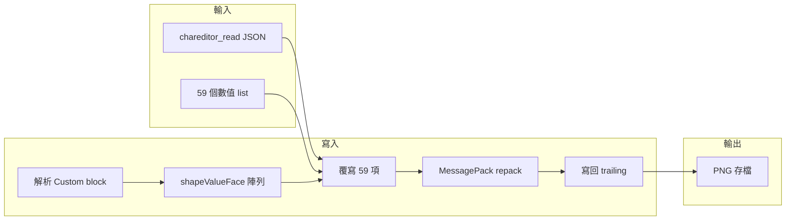

# 把目前臉型寫入 HS2 存檔 — 實作計畫

## 現狀摘要

- **臉型儲存**：HS2 臉部為 59 個 `shapeValueFace`，遊戲值多為 -100～200，存檔為 `float = 遊戲值/100`。
- **存檔格式**：多數現有卡為 **MessagePack**（trailing 內 BlockHeader + Custom 區塊），Custom 內有 `shapeValueFace` 陣列（59 個 float）；少數為舊版 **raw**（關鍵字 `shapeValueFace` 後 key_end+1+offset 每格 5 byte）。
- **既有程式**：
  - [write_face_params_to_card.py](d:\HS4\write_face_params_to_card.py)：只支援**部分**參數（`PARAM_TO_OFFSETS` / `PARAM_TO_LIST_INDICES` 僅輪廓+部分眼/鼻/嘴），無法一次寫入**全部 59 項**。
  - [read_face_params_from_card.py](d:\HS4\read_face_params_from_card.py)：`FACE_OFFSETS` 只有 54 項（缺耳朵 5 項）。
  - HS2CharEdit 存檔時用 **raw 寫法**（key_end+1+offset 寫 4 byte LE）；若卡片是 MessagePack，會寫壞 Custom 區塊，遊戲讀取可能異常。

因此「目前的臉型」要**真的**寫進存檔並被遊戲正確讀取，需要：**以 MessagePack Custom 區塊為主的寫入路徑**，且支援**完整 59 個參數**。

---

## 目錄慣例

- **輸入**：放在 `**SRC`**（例如角色卡 PNG、chareditor_read / chareditor_check JSON、59 值 list 等）。
- **輸出**：放在 `**output`**（例如寫入臉型後的角色卡、驗證報告、讀回臉型 JSON 等）。

腳本預設或範例路徑會依此慣例（如讀取 `SRC/xxx.png`、寫出 `output/xxx_edited.png`）；指令列仍可指定任意路徑覆寫。

---

## 目標

1. **定義「目前臉型」的輸入格式**：能來自 chareditor 報告（`chareditor_read`）、或 59 個數值（list/dict）。
2. **實作完整 59 項寫入**：優先寫入 MessagePack Custom 區塊的 `shapeValueFace` 陣列；必要時 fallback 至 raw offset（僅限非 MessagePack 卡）。
3. **可驗證**：寫入後能讀回或進遊戲確認臉型一致。

---

## 實作方案

### 1. 對照：59 個 cha_name ↔ list index（0～58）

- 前 54 項：offset 3, 8, …, 268 → list index = `(offset - 3) // 5`（與 [ChaFile_變數位置對照表.md](d:\HS4\ChaFile_變數位置對照表.md) 一致）。
- 耳朵 5 項：offset 273, 278, 283, 288, 293 → list index 54, 55, 56, 57, 58。
- 在 [write_face_params_to_card.py](d:\HS4\write_face_params_to_card.py) 中新增常數：**CHA_NAME_TO_LIST_INDEX**（59 個）與 **ALL_FACE_CHA_NAMES**（固定順序），供「依名稱寫入」與「依序寫入 59 個值」使用。

### 2. 擴充 write_face_params_to_card.py

- **輸入**：
  - **A**：`chareditor_read` 風格 — `dict[str, int]`（cha_name → 遊戲值 -100～200）。若 key 與 59 個 cha_name 對齊，則全部寫入。
  - **B**：`list[float]` 或 `list[int]` 長度 59 — 依 index 0～58 寫入；int 視為遊戲值（÷100 成 float），float 直接當儲存值。
- **MessagePack 路徑**（`_write_via_custom_block_impl`）：
  - 從 trailing 解析 BlockHeader → Custom 區塊 → 反序列化取得含 `shapeValueFace` 的物件。
  - 若輸入為 dict：用 CHA_NAME_TO_LIST_INDEX 將每個 cha_name 對應到 list index，寫入 `face_list[idx] = game_val/100.0`（或 float 直接寫）。
  - 若輸入為 list：直接依 index 0～58 覆寫 `face_list`（長度與範圍檢查後寫入）。
  - 替換後**整段 Custom blob 長度不變**（只改 shapeValueFace 陣列內容，不增刪 key），再寫回 trailing。若 repack 後 blob 長度與原 size 不同，則不寫入並回傳錯誤或 fallback。
- **Raw fallback**：僅當 MessagePack 路徑失敗時使用；且需補齊 59 個 offset 與 cha_name 的對照（含耳朵），依 key_end+1+offset 寫 4 byte LE float。

### 3. 讀取端補齊 59 項（可選但建議）

- 在 [read_face_params_from_card.py](d:\HS4\read_face_params_from_card.py) 的 `FACE_OFFSETS` 補上耳朵 5 項（273～293），與對照表一致，方便寫入後讀回比對。

### 4. 指令列與呼叫方式

- **目錄**：輸入檔自 **SRC**、輸出檔寫入 **output**（可於預設值或範例中採用；`-o` / `--output` 可覆寫）。
- `write_face_params_to_card.py`：
  - 現有 `--params`（JSON）、`--set name=value` 保留，用於部分參數。
  - 新增選項：例如 `--face-json <path>` 或 `--chareditor-read <path>`：讀取含 `chareditor_read` 的 JSON（可放 SRC），將 59 個 key 寫入存檔；輸出卡可預設寫入 `output/`。
  - 或 `--face-list` 接受 59 個數值（需定義格式，例如單行或 JSON array）。
- 若 run_poc / 其他腳本產出「目前臉型」為 chareditor_check.json（例如在 SRC），可呼叫：  
`python write_face_params_to_card.py SRC/card.png --params SRC/card.chareditor_check.json -o output/card_edited.png`，並在腳本內辨識 `chareditor_read` 鍵，自動走「全 59 項寫入」邏輯。

### 5. HS2CharEdit 存檔與 MessagePack 的關係（說明／可選防呆）

- 編輯器存檔時一律用 raw 寫法寫臉部；若卡片為 MessagePack，會破壞 Custom 區塊。
- **建議**：在文件或註解中說明「MessagePack 格式卡請用 Python 腳本寫入臉型」；若有需要，可在 HS2CharEdit 存檔前偵測 trailing 是否為 MessagePack（例如可解析 BlockHeader），若為是則提示「此卡為 MessagePack 格式，儲存臉部可能導致遊戲讀取異常，建議用專案內 write_face_params_to_card 寫入臉型」或僅不寫入 face 區塊（實作複雜度較高，可列為後續）。

---

## 資料流（概念）

---

## 檔案變更清單

| 檔案                                                                    | 變更                                                                                                       |
| --------------------------------------------------------------------- | -------------------------------------------------------------------------------------------------------- |
| [write_face_params_to_card.py](d:\HS4\write_face_params_to_card.py)   | 新增 59 項 cha_name↔index 對照；支援「全臉 dict」或「59 長 list」輸入；MessagePack 路徑改為可寫入全部 59 項；raw fallback 補齊耳朵 offset。 |
| [read_face_params_from_card.py](d:\HS4\read_face_params_from_card.py) | `FACE_OFFSETS` 補齊耳朵 5 項（273～293），與對照表一致。                                                                 |
| 文件／README                                                             | 說明「目前臉型」寫入方式、目錄慣例（輸入 **SRC**、輸出 **output**）、以及 MessagePack 卡以該腳本寫入為準。                                    |

---

## 驗證建議

1. 取一張 MessagePack 格式卡放 **SRC**，用 HS2CharEdit 或 `read_face_params_from_card` 得到 59 個值，再以 `--params`（chareditor_read）寫入，輸出到 **output**，用 `read_face_params_from_card` 或遊戲內載入確認臉型一致。
2. 用 59 個固定值（如全 50）寫入，輸出至 output，讀回並比對 59 項數值。
3. 若有可能，比對寫入前後 Custom 區塊的 MessagePack 解碼結果，確認僅 `shapeValueFace` 改變、blob 長度不變。

---

## 小結

- **「目前的臉型」**：以 chareditor_read（59 個 cha_name→值）或 59 個數值 list 表示。
- **寫入**：擴充 [write_face_params_to_card.py](d:\HS4\write_face_params_to_card.py)，以 **MessagePack Custom 區塊** 寫入完整 59 項 `shapeValueFace`，確保遊戲讀取正確；raw 僅作 fallback。
- **讀取**：補齊 [read_face_params_from_card.py](d:\HS4\read_face_params_from_card.py) 的 59 項，方便驗證。

完成後即可把「目前臉型」真正、完整地寫進 HS2 存檔並在遊戲中正確顯示。