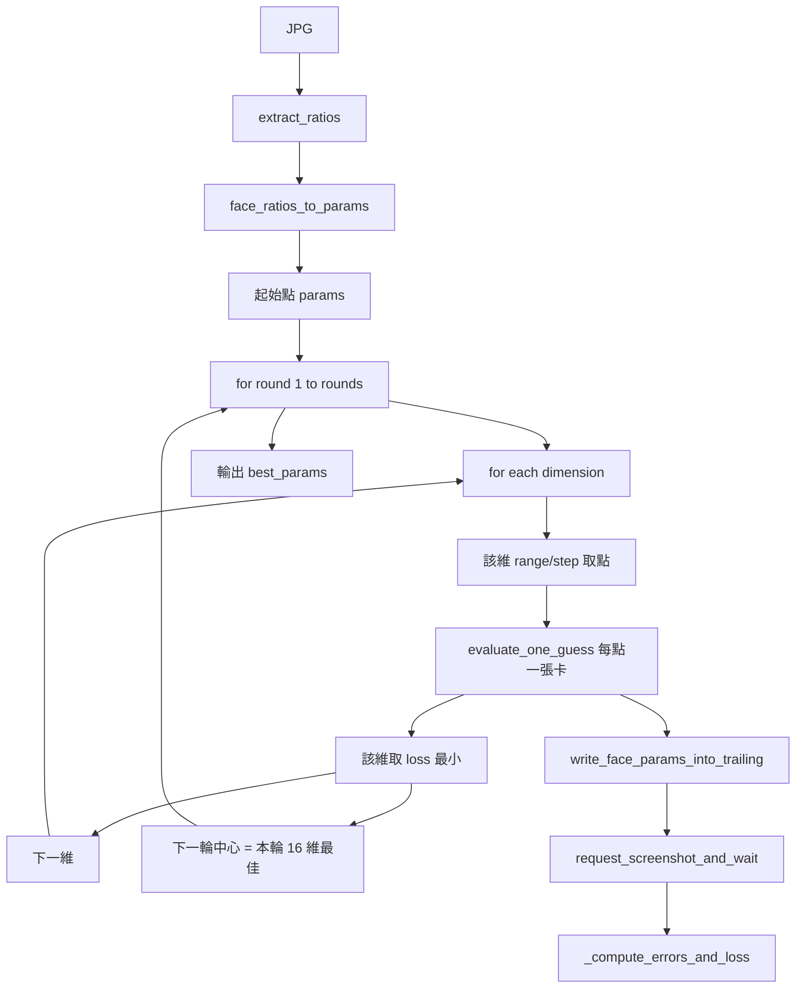

# 臉型優化：一次一維搜尋計畫（參數化輪數／範圍／步長）

本文件為 **一次動一維** 搜尋策略的計畫書；輪數、每輪搜尋範圍、每輪步長皆為**可調參數**，之後可直接改數值調整行為。

---

## 目標

- **搜尋策略**：**一次只動一維**，其餘維度固定於目前最佳（或起點）。每輪對 16 維各做一維掃描，取該維 loss 最小的值，再進入下一維／下一輪。
- **參數化**：以下皆為腳本參數（CLI 或設定），方便之後改數值即調整：
  - **輪數**（rounds）：要做幾輪一維掃描（例如 2）。
  - **每輪搜尋範圍**（range）：每維以「目前中心」為準的 ± 半寬（例如第 1 輪 90、第 2 輪 45）。
  - **每輪步長**（step）：該輪內一維上的取樣間隔（例如第 1 輪 30、第 2 輪 15）。
- **最大化沿用既有程式**：只新增／調整腳本，不修改 run_experiment、run_phase1、blackbox、ratio_to_slider、write_face_params_to_card 等既有檔案。
- **一鍵回復**：若會動到 HS2 設定，沿用 `python hs2_photo_to_card_config.py restore --hs2-root <路徑>`。

---

## 搜尋邏輯（一次一維）

- **起點**：目標 JPG → MediaPipe → `face_ratios_to_params` → 一組 16 維 `start_params`。
- **第 k 輪**（k = 1 .. rounds）：
  - **中心**：第 1 輪以 `start_params` 為中心；第 2 輪起以「上一輪結束時每維的最佳值」為中心。
  - 對每個維度 `name`（16 個）：
    - 該維在 `[center[name] - range_k, center[name] + range_k]` 內，以步長 `step_k` 取點（邊界 clamp 到 [-100, 200]）。
    - 點數為：約 `2 * range_k / step_k + 1`（或依實際 clamp 後區間計算），例如 range=90、step=30 → 7 點。
    - 對該維的每個取值：其餘 15 維固定為目前中心，僅 `params[name]` 變動 → 產 1 張卡 → 截圖 → MediaPipe → total_loss。
  - 該維取 **loss 最小** 的那個值，更新「目前該維最佳值」；全部 16 維掃完後得到本輪的 16 維最佳，作為下一輪中心。
- **人物卡數**：每輪 = 16 維 × 每維取樣數。例如 range=90、step=30 → 每維 7 點 → 每輪 16×7 = **112 張**；若 2 輪則共 224 張（依參數而定）。

---

## 可調參數一覽（建議 CLI）

| 參數 | 說明 | 範例預設 | 備註 |
|------|------|----------|------|
| **輪數** | 要做幾輪「一次一維」掃描 | 2 | `--rounds` |
| **第 1 輪範圍** | 第 1 輪每維 ± 半寬 | 90 | `--range1`，clamp 到 [-100,200] |
| **第 1 輪步長** | 第 1 輪一維取樣間隔 | 30 | `--step1` |
| **第 2 輪範圍** | 第 2 輪每維 ± 半寬 | 45 | `--range2` |
| **第 2 輪步長** | 第 2 輪一維取樣間隔 | 15 | `--step2` |

若輪數 > 2，可採「每輪一組 range/step」的列表（例如 `--ranges 90,45`、`--steps 30,15`），或固定第 3 輪起用與第 2 輪相同；實作時可選其一，以改數值即調為原則。

---

## 既有可沿用項目（不變）

| 用途 | 既有模組／函數 | 出處 |
|------|----------------|------|
| 目標 face_ratios + 起始 params | `extract_ratios`, `face_ratios_to_params` | extract_face_ratios.py, ratio_to_slider.py |
| 產卡 | `find_iend_in_bytes`, `write_face_params_into_trailing` | read_hs2_card.py, write_face_params_to_card.py |
| 截圖 | `request_screenshot_and_wait` | run_phase1.py |
| 誤差與 loss | `_compute_errors_and_loss` | run_phase1.py |
| 遊戲就緒 | `wait_for_ready_file` | run_phase1.py |
| 16 個 slider 名與邊界 | ratio_to_slider_map.json + game_slider_range | blackbox._load_game_slider_range 同源 |

---

## 一鍵回復與 HS2

- 腳本僅寫入 output/；若曾用 `hs2_photo_to_card_config.py set` 改過 BepInEx 設定，還原：  
  `python hs2_photo_to_card_config.py restore --hs2-root <路徑>`

---

## 新／調整檔案與職責

### 1. 單一猜測評估與紀錄（evaluate_face_guess.py）

- `evaluate_one_guess_and_record(...)`：產 1 張卡 → 請求截圖 → MediaPipe → 寫入 `trial_dir/comparison_<run_ts>.json`（**errors_percent** 百分比、total_loss、card_path、screenshot_path）→ 回傳 total_loss。僅呼叫既有函數（read_hs2_card、write_face_params_to_card、run_phase1、extract_face_ratios），不修改既有程式。

### 2. 主腳本：run_onedim_face.py（已實作）

- **參數**：`--rounds`（預設 2）、`--range1`（預設 90）、`--step1`（預設 30）、`--range2`（預設 45）、`--step2`（預設 15）；第 3 輪起沿用 range2/step2。以及 `--target-image`、`--base-card`、`--request-file`、`--output-dir`、`--map`、`--launch-game`、`--ready-timeout`、`--screenshot-timeout`、`--progress-interval`、`--experiment-id`。
- **流程**：起點 → for round 1..rounds：對每維做一維掃描（範圍 = 該輪 range、步長 = 該輪 step），每點呼叫 `evaluate_one_guess`，該維取 loss 最小者更新中心；下一輪以本輪結束的 16 維最佳為中心。
- **輸出**：最終 16 維最佳寫入 `output/experiments/<experiment_id>/best_params_onedim_<timestamp>.json`（內含 best_params、rounds、range_per_round、step_per_round、total_cards_evaluated）。

---

## 資料流概覽（一次一維）

---

## 實作要點摘要

- **一次一維**：每輪對 16 維依序掃描；每維只改該維，其餘 15 維固定為目前中心。
- **卡數**：每輪 = 16 × 每維取樣數；每維取樣數 = 該輪範圍內以步長取點數（邊界 clamp 後計算）。
- **參數化**：輪數、每輪搜尋範圍、每輪步長皆為可調參數，改數值即可調整行為，無需改程式邏輯。
- **邊界**：所有取值 clamp 到 [-100, 200]；範圍以 `lo = max(-100, center - range)`、`hi = min(200, center + range)` 計算。

---

## 紀錄與產出管理（已實作）

- **每次產出**：每個 trial 目錄（`round_<k>/dim_<name>/point_<i>/`）內含：人物卡 `cards/card_00_<run_ts>.png`、截圖 `screenshots/screenshot_00_<run_ts>.png`、比較結果 `comparison_<run_ts>.json`（內含 **errors_percent** 百分比、total_loss、card_path、screenshot_path）。由 [evaluate_face_guess.py](../evaluate_face_guess.py) 的 `evaluate_one_guess_and_record` 寫入，僅呼叫既有模組。
- **不覆寫**：實驗 ID 為 `onedim_<run_ts>`，每次執行不同 run_ts，產出寫入 `output/experiments/onedim_<run_ts>/`，與舊實驗分開。
- **時間戳**：所有產出與紀錄檔名皆含 `run_ts`（如 `best_params_onedim_<run_ts>.json`、`manifest_<run_ts>.json`、`comparison_<run_ts>.json`、卡與截圖檔名）。
- **實驗 manifest**：`manifest_<run_ts>.json` 記錄本實驗產出一覽、layout 說明、總卡數、一鍵還原指令。

---

## 會動到 HS2 時的一鍵還原

- 本腳本僅寫入 `output/`，不寫入 HS2 安裝目錄。若曾用 `hs2_photo_to_card_config.py set` 修改 BepInEx 的 RequestFile，還原方式：  
  `python hs2_photo_to_card_config.py restore --hs2-root <HS2路徑>`  
  還原會從該目錄下最新一份時間戳備份覆蓋回 `HS2.PhotoToCard.cfg`。
