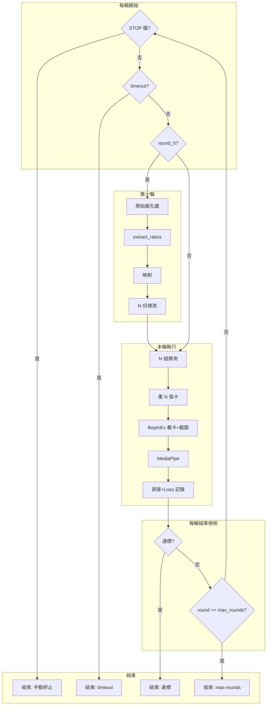

# 臉型導入與反覆測試架構（整合文件）

本文件為臉型導入、反覆測試架構、停止條件（含 timeout）、流程圖、備份與 BepInEx 依賴之單一真相來源。原分散於多份 .plan.md 的內容已整合於此，後續修訂請只改本文件。

---

## 1. 概述

- **目標**：讓 **輸出角色遊戲截圖 media pipe** 與 **原始臉孔 media pipe** 的對應項目盡可能接近，**每項誤差都在 10% 以內**；並以**完全自動化**多輪優化（猜測 → 產卡 → 截圖 → MediaPipe → 誤差/Loss → 下一輪猜測）直到達標或停止。
- **成功準則**：比對兩邊 MediaPipe 擷出的同一組項目（如 face_ratios）；達成方式為比例→滑桿映射、必要時校正，反覆直到每項 ≤10%；驗證可用 `validate_mediapipe.py` 或擴充報告。
- **前置條件**：第一階段可**全程無人工**（見 §1.2）：腳本以 `--launch-game` 啟動 HS2，BepInEx 插件自動進入角色編輯並寫出 game_ready.txt，之後程式驅動載卡與截圖。若不用 `--launch-game`，則需先手動開啟 HS2，腳本會等 game_ready.txt 再繼續。

### 1.1 簡化實驗階段（實作順序）

為簡化實驗過程，**先完成簡化架構**，再擴展為完整多輪實驗：

| 階段 | 說明 | 黑盒子假設 | 產出 |
|------|------|------------|------|
| **一輪一次** | 只跑一輪、本輪只產生一組猜測與一張卡 | 黑盒子 **output = input**（或直接不呼叫黑盒子，僅用第一輪起點產出一組 params） | 1 張卡 → 1 次截圖 → 1 組 MediaPipe → 1 個 Loss |
| **一輪兩次** | 只跑一輪、本輪產生兩組猜測與兩張卡 | 黑盒子回傳兩組：**第一組 = input**，**第二組 = input + 10**（每個滑桿值 +10，需 clamp 在遊戲範圍內） | 2 張卡 → 2 次截圖 → 2 組 MediaPipe → 2 個 Loss |
| **一輪十次**（目前實作） | 只跑一輪、本輪產生 10 組猜測與 10 張卡 | 黑盒子回傳 10 組：**第 i 組 = input × (100+i)%**，i=0..9（100%～109% 縮放，clamp 在 -100～200） | 10 張卡 → 10 次截圖 → 10 組 MediaPipe → 10 個 Loss；`run_experiment.py`、`blackbox.py` |
| **擴展** | 多輪、N 組猜測、真實黑盒子（如 Optuna） | 依 §10 黑盒子介面與後續 Optuna 實作 | 完整反覆測試架構（§4 流程圖） |

- **一輪一次**：驗證「第一輪起點 → 產卡 → 截圖 → MediaPipe → Loss」整條鏈路可跑通；目錄可沿用 `round_0/`，N=1（單一 guess、單一 card、單一 screenshot）；入口 `run_phase1.py`。
- **一輪兩次**：驗證「同一輪內多組猜測、多張卡、多張截圖」與黑盒子回傳多組的介面；N=2，黑盒子 stub 回傳 `[input, input+10]`。
- **一輪十次**：由給予的一組參數產出 10 組（100%、101%、…、109%），寫入 10 張卡送 HS2 截圖後比對；入口 `run_experiment.py`，每輪 N=10。
- **之後再擴展**：多輪迴圈、停止條件、timeout、N 可調、真實優化器等。

### 1.2 第一階段實作（Phase 1：全程無人工）

**目標**：**全程無人工** — 可選由腳本啟動 HS2，遊戲自動進入角色編輯並寫出就緒檔後，產卡 → 請求截圖 → MediaPipe → 誤差比對。

- **入口**：`run_phase1.py --target-image <臉孔圖> --base-card <基底卡> [--launch-game <HS2.exe>] [--output-dir output] [--request-file ...] [--ready-timeout 180] [--screenshot-timeout 120]`
- **流程**：(0) 可選 `--launch-game` 啟動遊戲；輪詢插件寫出之 `game_ready.txt`（同請求檔目錄），逾時 `--ready-timeout`；(1) 目標圖 → extract_ratios → face_ratios_to_params → 產出一張卡；(2) 寫入載卡請求檔，輪詢 `game_screenshot.png` 後複製至 round_0/screenshots；(3) MediaPipe 與誤差／loss 寫入 `mediapipe_results.json`。
- **前置**：BepInEx 載卡截圖插件已安裝；插件設定 **AutoEnterCharaCustom=true**（預設）、**RequestFile** 與腳本 `--request-file` 一致。遊戲啟動後插件會於延遲後載入 CharaCustom 場景並寫入 `game_ready.txt`。
- **共用**：`ratio_to_slider.py` 提供 `face_ratios_to_params`，供 run_poc 與 run_phase1 共用。

**重要：截圖必須真的在 HS2 裡生成**

- 腳本**不會**自動啟動 HS2，除非你傳入 `--launch-game <HoneySelect2.exe>`。
- 若未用 `--launch-game`，請**先手動啟動 HS2**，進入角色編輯（CharaCustom）畫面，並確認插件已寫出 `game_ready.txt`（與請求檔同目錄），再執行 `run_phase1.py` 或 `run_experiment.py`。
- 腳本只接受「**寫入請求檔之後**」由插件產生的 `game_screenshot.png`（依檔案修改時間判斷）；若 HS2 未運行，舊的截圖檔會被視為無效，腳本會一直等到逾時。因此不會再發生「沒開 HS2 卻沿用舊圖」而誤以為有在遊戲裡生成的情況。

---

## 2. 名詞定義

| 名詞 | 說明 |
|------|------|
| **原始臉孔** | 作為臉型來源的輸入圖（例如真人照），對應檔案如 `src/9081374d2d746daf66024acde36ada77.jpg`。 |
| **原始臉孔 media pipe** | 對「原始臉孔」圖做 MediaPipe 擷取的結果（臉部比例、landmarks 等），供映射成滑桿參數。 |
| **原始角色** | 作為基底的 HS2 角色卡（未寫入臉型前），如 `src/AI_191856.png`。 |
| **輸出角色** | 寫入臉型參數後產出的角色卡，如 `output/AI_191856_from_photo.png`。 |
| **輸出角色遊戲截圖** | 在遊戲內載入「輸出角色」後所截的圖（用於比對或校正）。 |
| **輸出角色遊戲截圖 media pipe** | 對「輸出角色遊戲截圖」做 MediaPipe 擷取的結果，用於與原始臉孔 media pipe 比對。 |

（若文件中使用「腳色」即指「角色」。）

---

## 3. 預設路徑與預覽

- **輸入**（未另指定時）：皆來自 `src/`
  - 臉型來源：`9081374d2d746daf66024acde36ada77`（副檔名需解析，如 .jpg / .jfif / .png）
  - 基底角色卡：`AI_191856.png`
- **輸出**：全部寫入 `output/`
  - 產出卡檔名：`AI_191856_from_photo.png`（即 `<基底卡 stem>_from_photo.png`）
- **實驗產出檔名皆帶時間戳**：`run_phase1.py` 與 `run_experiment.py` 寫入的檔名一律含 `YYYYMMDD_HHMMSS`（例如 `card_00_20250227_143052.png`、`screenshot_00_20250227_143052.png`、`mediapipe_results_20250227_143052.json`）；實驗目錄預設為 `phase1_<時間戳>` 或 `exp_<時間戳>`。避免不同次執行互相覆蓋或誤用舊檔。
- **17 ratio mapping 驗證**：以「原始 JPG vs 遊戲截圖」的 MediaPipe 誤差 % 評估 mapping 是否改善。跑完 `run_phase1` 或 `run_experiment` 後，用 `report_17_ratio_mapping.py --experiment-dir <round_0 路徑> -o <報告>` 產出每項 ratio 的誤差表與摘要（見 `docs/17_ratio_to_hs2_slider_對照.md`）。
- **預覽版型**：**配合現狀** — 上 = 原卡 PNG、下 = --preview-image（不改順序）

### 3.1 既有流程對照（產卡 → 啟動 HS2 → 鏡頭 → 截圖 → MediaPipe）

以下皆為**既有實作**，勿重複造輪；新腳本只應**串接**這些入口與輸出。

| 步驟 | 負責模組 | 檔案／位置 | 說明 |
|------|----------|------------|------|
| **產人物卡** | Python 主流程 | `run_phase1.py` 步驟 1–2 | 目標圖 → `extract_face_ratios.extract_ratios` → `ratio_to_slider.face_ratios_to_params` → `write_face_params_to_card.write_face_params_into_trailing`；產出卡寫入 `round_0/cards/`。 |
| **啟動 HS2** | 同上 | `run_phase1.py --launch-game <exe>` 或 `run_phase1_full.ps1` | 腳本呼叫 `subprocess.Popen(exe)`；或由 `run_phase1_full.ps1` 設定 `$Hs2Exe` 後傳入。 |
| **調整鏡頭** | BepInEx 插件 | `BepInEx_HS2_PhotoToCard`、`docs/FOV調整與截圖構圖紀錄.md` | 插件在**第一次截圖時**將相機目標設為頭部（`cf_J_Head`）、拉近 FOV 使臉約占畫面 35% 高度；FOV 寫入 `game_screenshot_fov.txt`。 |
| **截圖** | BepInEx 插件 + Python 輪詢 | 插件寫出 `game_screenshot.png`（與請求檔同目錄）；`run_phase1.request_screenshot_and_wait` 輪詢並複製到 `round_0/screenshots/` | 插件讀取 `load_card_request.txt`（一行卡路徑）→ 載卡（僅臉）→ 截圖；Python 寫入請求檔後等待檔案 mtime 晚於寫入時間。 |
| **MediaPipe 比對** | Python | `run_phase1.py` 步驟 4：`extract_ratios(screenshot)` + `_compute_errors_and_loss` → `mediapipe_results.json` | 每張截圖一組 face_ratios，與 target_ratios 算誤差與 loss。 |
| **17 ratio 誤差報告** | Python | `report_17_ratio_mapping.py --experiment-dir <round_0> -o <報告>` | 從 round 目錄讀 `target_mediapipe_*.json` 與 `screenshots/screenshot_*.png`，產出各 ratio 的 target/actual/error_% 表（見 `docs/17_ratio_to_hs2_slider_對照.md`）。 |

**一條龍入口（一輪一次）**：`run_phase1_full.ps1` 已串接「啟動 HS2 → 等 game_ready → 產卡 → 截圖 → MediaPipe」；僅需修改腳本內 `$Hs2Exe`、`$TargetImage`、`$BaseCard`。若要再產出 17 ratio 報告，於同次 run 後對該次實驗的 `round_0` 執行 `report_17_ratio_mapping.py --experiment-dir ... -o ...`，或使用專案內 `run_phase1_then_17_report.ps1`（固定 experiment-id 後串接上述兩者，無新增邏輯）。

---

## 4. 主流程與流程圖

主迴圈：每輪開始先**檢核**（STOP 檔、timeout），再依是否為 round_0 走「第一輪起點」或「黑盒子」產出 N 組猜測 → 產卡 → 截圖自動化 → MediaPipe → 誤差/Loss 記錄 → 每輪結束**檢核**（達標？max_rounds？）→ 結束或下一輪。四種結束：**達標**、**手動終止**、**max-rounds**、**timeout**。

- round_0 時 Guesses 由「第一輪起點」產出；round ≥ 1 時由**黑盒子**產出（圖中簡化為 CheckRound0「否」→ Guesses）。

---

## 5. 資料結構與目錄

- **實驗 (experiment)**：一筆優化 run，有 `experiment_id`、目標 MediaPipe（來自原始臉孔）、基底卡路徑、可選每輪猜測數 N（預設 10）。
- **輪次目錄**：`output/experiments/<experiment_id>/round_<k>/`
  - `guesses.json`：本輪 N 組猜測（params dict）。
  - `cards/`：`card_00.png` … `card_<N-1>.png`
  - `screenshots/`：截圖自動化寫入 `screenshot_00.png` … `screenshot_<N-1>.png`
  - `mediapipe_results.json`：每張截圖的 MediaPipe 結果與對目標的誤差
  - 可選 `manifest.json`；實驗根目錄可含 **STOP** 檔供手動終止

---

## 6. 第一輪起點（沿用現有 CODE）

- **輸入**：原始臉孔圖路徑、基底卡路徑、`ratio_to_slider_map.json`（預設專案內）。
- **步驟**（與 run_poc 一致）：
  1. 呼叫 `extract_face_ratios.extract_ratios` 取得 `face_ratios`（目標 MediaPipe）。
  2. 使用與 run_poc 相同的邏輯：讀取 ratio_to_slider_map 的 `ratios` 與 `calibration`，線性映射後依 `game_slider_range` 縮放，得到**一組** `params`（dict）。
  3. 由此組 params 產生第一輪 **N 份猜測**（可先 N 份相同，或 1 份 + (N-1) 份小擾動）。
- **輸出**：round_0 的 `guesses.json` 與目標 MediaPipe 存到實驗目錄。
- **共用**：將 run_poc 的「ratio → params」抽出為 `face_ratios_to_params(ratios, map_path)`，供 run_poc 與本架構共用（如 `ratio_to_slider.py`）。

---

## 7. 猜測 → 產卡

- **輸入**：本輪 N 組猜測（list of params dict）、基底卡路徑、本輪輸出目錄。
- **邏輯**：對每組猜測讀取基底卡 trailing，呼叫 `write_face_params_into_trailing` 寫入該組 params，PNG 與新 trailing 寫出至 `round_<k>/cards/card_<i>.png`。基底卡未提供的 59 項保持原卡數值。

---

## 8. 截圖自動化（人力零介入）

- **依賴**：BepInEx 插件實作「讀取載卡請求檔 → 載入指定卡（僅臉）→ 截圖寫出至約定路徑」；請求檔一行卡路徑、輸出固定檔名如 `game_screenshot.png`。
- **本輪 N 張截圖**：對 i = 0..N-1 依序：(1) 將 card_i 絕對路徑寫入請求檔 (2) 輪詢插件截圖檔（逾時 60–120 秒）(3) 偵測到後複製至 `round_<k>/screenshots/screenshot_<i>.png` (4) 下一張。
- **前置**：實驗啟動前，使用者一次開啟 HS2 並進入角色編輯／讀取畫面。

---

## 9. MediaPipe、誤差與 Loss（第一版）

- 對每張 `screenshot_<i>.png` 呼叫 `extract_face_ratios.extract_ratios`，得 N 組 face_ratios；與目標 MediaPipe 比較，計算每項誤差（建議相對誤差 e = |actual - target| / max(|target|, ε) × 100%），寫入 `mediapipe_results.json`。
- **第一版 Loss**（每維度誤差 e 為百分比）：
  - **e < 2%**：貢獻 0
  - **2% ≤ e < 5%**：貢獻 = `e - 2`
  - **5% ≤ e < 10%**：貢獻 = `3e - 12`（三倍懲罰）
  - **e ≥ 10%**：貢獻 = `10e - 82`（十倍懲罰）
- **總 loss** = 各維度貢獻之和（或平均）；達標可訂「總 loss < 門檻」或「無任一維度 e ≥ 10%」。

---

## 10. 黑盒子介面

- **介面**：`get_next_guesses(target_mediapipe, previous_rounds, n_guesses, base_card_path, experiment_id, **kwargs) -> list[dict]`；回傳 N 組猜測（params dict），格式與寫卡相容。
- **簡化階段實作**（§1.1）：
  - **一輪一次**：不呼叫黑盒子，或黑盒子回傳 `[input]`（output = input）；僅用第一輪起點產出一組即可。
  - **一輪兩次**：黑盒子回傳 `[input, input+10]`（第一組 = 傳入的 params 原樣，第二組 = 每個滑桿值 +10 並 clamp 在遊戲範圍 -100～200）。
  - **一輪十次**（目前 stub）：黑盒子回傳 10 組，第 i 組 = 傳入 params 每個滑桿值 × (100+i)/100，i=0..9（即 100%、101%、…、109%），再 clamp 在 game_slider_range（-100～200）；實作於 `blackbox.py`。
- **Stub（擴展前）**：round_0 由第一輪起點產出一組，再呼叫黑盒子擴成 N 組（如 N=10）；round≥1 時 previous_rounds 非空，可回傳「上一輪 loss 最小那一組」複製 N 份或小擾動。之後可改接 **Optuna**。

---

## 11. 停止條件（四類）

| 條件 | 觸發時機 | 說明 |
|------|----------|------|
| **達標** | 本輪 loss/誤差達門檻 | 得到最佳值，正常結束 |
| **手動中止** | STOP 檔存在或 Ctrl+C | 每輪前檢查 STOP；Ctrl+C 捕獲 SIGINT |
| **max-rounds** | 已完成輪數 ≥ `--max-rounds` | 避免無限輪次 |
| **timeout** | 已執行時間 ≥ `--timeout` 秒 | 啟動時記錄 start_time；每輪前檢查 elapsed |

四者**並列**，任一成立即結束。

---

## 12. 入口與參數

- **主入口**：`run_experiment.py --experiment-id EXP --target-image PATH --base-card PATH [--max-rounds M] [--timeout SECONDS] [--request-file PATH] [--screenshot-output PATH]`
  - `--timeout SECONDS`：最長執行時間（秒），逾時則結束；未指定則不啟用。
- **每輪步驟**：
  1. 若存在 **STOP** 檔則結束；若已設定 **--timeout** 且 **elapsed >= timeout** 則結束；否則若 round_0 執行第一輪起點並寫入 guesses + 目標 MediaPipe；若 round_K（K≥1）呼叫 `get_next_guesses(...)` 寫入本輪 `guesses.json`。
  2. 猜測 → 產卡：寫出 N 張卡至 `round_<k>/cards/`。
  3. 截圖自動化：對 i = 0..N-1 寫入載卡請求、輪詢截圖、存成 `screenshots/screenshot_<i>.png`。
  4. 對 N 張截圖跑 MediaPipe，寫入 `mediapipe_results.json`，計算誤差與 loss。
  5. 若達標或 round ≥ max_rounds：結束；否則 round += 1，回到步驟 1。
- **可選**：`run_round.py` 僅做單輪供除錯。

---

## 13. 備份與實驗記錄

- **重點**：改動 **d:/HS2** 內檔案前必備份；備份依實驗 ID 分開存放，不互相覆蓋，並記錄每次實驗與備份路徑。
- **原則**：改動前複製到專案備份區（如 `backups/<experiment_id>/`）；實驗記錄含 experiment_id、timestamp、modified_files（path、backup_path、is_hs2）。
- **實作**：共用 `backup_before_write(dest_path, experiment_id, hs2_root=None)`；所有會寫入 d:/HS2 的腳本在寫入前呼叫。可選 `--hs2-dir`、`--experiment-id`、`--backup-dir`。
- **反覆測試**：目前寫入 `output/experiments/`，未直接寫 HS2；未來若有步驟寫入 HS2（如複製產出卡到遊戲目錄），須在該步驟前呼叫備份邏輯。
- **一鍵還原**：若曾用 `hs2_photo_to_card_config.py set` 修改 BepInEx 設定，還原指令為 `python hs2_photo_to_card_config.py restore --hs2-root <路徑>`（見 `docs/如何啟動HS2.md` §7、`docs/既有已驗證腳本與流程.md` §5）。一次一維腳本 `run_onedim_face.py` 每次產出人物卡、截圖、比較結果（誤差百分比）皆寫入各 trial 目錄，檔名與實驗 ID 含時間戳，不覆寫舊實驗。

---

## 14. 檔案變更摘要

| 項目 | 變更 |
|------|------|
| 共用映射邏輯 | 抽出 `face_ratios_to_params`，供 run_poc 與第一輪起點共用 |
| 第一輪起點 | 原始臉孔 → extract_ratios → face_ratios_to_params → N 份猜測，寫入 round_0 並存目標 MediaPipe |
| 黑盒子 | `blackbox.py`：`get_next_guesses(...)` 介面與 stub；未來接 Optuna |
| 產卡與 MediaPipe | 呼叫現有 write_face_params_into_trailing、read_hs2_card、extract_ratios |
| 截圖自動化 | 依序寫入載卡請求、輪詢 BepInEx 插件截圖、複製至 screenshot_<i>.png；依賴 BepInEx 插件 |
| 停止條件 | 每輪前檢查 STOP 與 timeout；每輪後檢查達標與 max-rounds；支援 Ctrl+C |
| 入口 | `run_experiment.py` 主迴圈，參數含 `--timeout`；可選 `run_round.py` 單輪除錯 |
| 備份 | `backup_utils.py`、backups/<experiment_id>/；寫入 HS2 前必呼叫 |

---

## 15. 驗證

- 執行 `run_experiment.py`，確認 round_0 產出 N 張卡後依序取得 N 張截圖、寫入 mediapipe_results.json、自動進入 round_1，**全程無手動載卡或截圖**。
- 建立 STOP 檔後下一輪開始前程式結束；Ctrl+C 可優雅結束並保留已完成的輪次。
- 設定 `--timeout` 後執行，確認逾時後正常結束並寫入狀態。
- 第一輪 params 與直接跑 run_poc 對同一張圖結果一致（或僅差在 N 份複製/擾動）。

---

## 16. 附錄：BepInEx 載卡截圖約定

- **請求檔**：例如 `output/load_card_request.txt`，內容一行為要載入的卡片**完整路徑**。插件定時檢查，讀取後刪除或清空請求檔，再執行載卡＋截圖。
- **截圖輸出**：固定檔名如 `game_screenshot.png`（與請求檔同目錄或約定目錄）。
- **載卡**：僅臉 — `LoadFileLimited(..., face: true, body: false, ...)` + Reload；僅在角色編輯場景下動作。
- **截圖構圖與 FOV**：第一次截圖時插件會將相機目標對準頭部（cf_J_Head）並拉近 FOV，使臉部約占畫面 35% 高度，避免頭被裁切；FOV 寫入 `game_screenshot_fov.txt` 且不還原。詳見 **[FOV調整與截圖構圖紀錄.md](FOV調整與截圖構圖紀錄.md)**。
- 詳見專案內 BepInEx 自動載卡截圖計畫（`MD FILE/plans/bepinex_自動載卡截圖_6f5ae78b.plan.md` 或 `.cursor/plans` 對應檔）。
